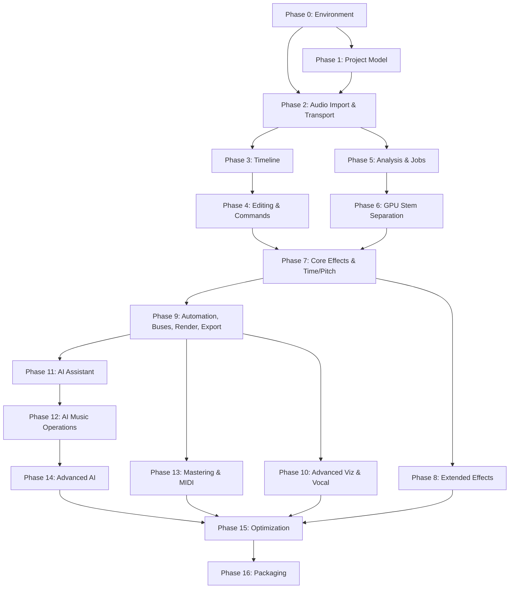

# MaxAudioEditor — Implementation Plan

## A. Executive Summary

MaxAudioEditor is a **fully local, GPU-accelerated, AI-native browser-based audio/music editor**. It is architecturally a DAW delivered via a local web UI, backed by a Python FastAPI server that orchestrates GPU-accelerated AI inference, DSP processing, and offline rendering.

### What We Are Building

A production-grade system where users can import audio → analyze (BPM/key/structure) → separate stems via local GPU → edit regions independently on a multi-track timeline → apply professional effects and automation → use natural-language AI commands → generate/transform/extend music locally → master → render/export — all without any cloud API dependency.

### Core Architecture

```
Browser (Vanilla HTML/CSS/JS + Web Audio API + Canvas 2D)
    ↕ HTTP REST + WebSocket (localhost)
FastAPI Server (Python + Uvicorn)
    ↕
Job Manager / Worker Pool
    ↕
DSP Engine | AI Model Registry | Offline Renderer
    ↕
GPU (CUDA/PyTorch) | CPU Fallback
    ↕
Local Filesystem (Projects / Media / Models / Cache)
```

### Local-First Philosophy

No network calls at runtime. Internet is used only during initial setup (pip install, model downloads). Once installed, the system runs fully offline. The user's GPU is treated as the primary compute resource for AI inference and heavy DSP.

### GPU Strategy

- Target hardware: NVIDIA RTX 4050 (6 GB VRAM) as baseline
- PyTorch with CUDA for all AI models
- VRAM-aware job scheduler prevents OOM
- Model warm-pooling to avoid redundant load/unload cycles
- FP16/BF16 mixed precision where quality permits
- CPU fallback for all operations (slower but functional)
- Configurable quality tiers per user VRAM budget

### Major Subsystems

| Subsystem | Technology |
|-----------|-----------|
| Frontend UI | Vanilla HTML/CSS/JS, ES Modules |
| Audio Engine | Web Audio API + AudioWorklet |
| Visualization | Canvas 2D |
| Backend Server | Python, FastAPI, Uvicorn |
| Job System | asyncio + multiprocessing workers |
| Stem Separation | Demucs (htdemucs, htdemucs_6s) via PyTorch |
| Music Analysis | madmom/librosa (BPM/beats), CREPE/librosa (key) |
| AI Assistant | Local LLM (Phi-3-mini or Mistral-7B-Instruct GGUF via llama-cpp-python) |
| Music Generation | MusicGen (facebook/musicgen-small/medium) via PyTorch |
| Audio-to-MIDI | basic-pitch (Spotify) |
| Time/Pitch | pyrubberband (Rubber Band Library) |
| DSP/Effects | NumPy/SciPy + Web Audio native nodes |
| Offline Render | Python (soundfile + NumPy) |
| Storage | Filesystem + SQLite metadata index |

### Development Strategy

16 phases, dependency-ordered, each delivering a testable vertical slice. Every phase produces a runnable application. No fake features. No placeholders that pretend to work.

---

## B. Requirements Reconciliation

### Priority Matrix

> [!NOTE]
> Requirements are extracted from all 9 documents: README, PRD, FRD, SRD, TRD, FEATURES, PHASES, STRUCTURE, MASTER_PROMPT. Where documents differ, the more detailed/specific requirement takes precedence.

| ID | Requirement | Source(s) | Priority | Phase | Approach |
|----|------------|-----------|----------|-------|----------|
| R001 | New/Open/Save project | PRD§6A, FRD§FR-001, FEATURES§2 | MUST HAVE | 1 | JSON project file in .maxaudio directory |
| R002 | Audio import (WAV/MP3/FLAC/OGG/M4A) | FRD§FR-002, FEATURES§3, MASTER§5 | MUST HAVE | 2 | FFmpeg via pydub/ffmpeg-python |
| R003 | Multi-track timeline | PRD§6B, FRD§FR-004, FEATURES§5 | MUST HAVE | 3 | Canvas 2D, JS module |
| R004 | Waveform display | FRD§FR-003, TRD§9, FEATURES§7 | MUST HAVE | 3 | Multi-resolution peak pyramids |
| R005 | Transport (play/pause/stop/seek) | FEATURES§9, MASTER§3 | MUST HAVE | 2 | Web Audio API scheduling |
| R006 | Clip editing (split/trim/move/duplicate/delete) | FRD§FR-005, FEATURES§20, MASTER§8 | MUST HAVE | 4 | Command pattern + state mutations |
| R007 | Non-destructive editing | FRD§FR-006, FEATURES§93, MASTER§4 | MUST HAVE | 1 | Immutable source, project state edits only |
| R008 | Undo/redo | FRD§FR-007, FEATURES§71, MASTER§32 | MUST HAVE | 4 | Command stack with inverse operations |
| R009 | BPM detection | FRD§FR-008, FEATURES§10 | MUST HAVE | 5 | madmom/librosa |
| R010 | Key detection | FRD§FR-009, FEATURES§14 | MUST HAVE | 5 | librosa key estimation |
| R011 | Beat grid + snapping | FRD§FR-010, TRD§11, FEATURES§13 | MUST HAVE | 3 | Beat-aware coordinate system |
| R012 | Section detection | FRD§FR-011, FEATURES§49 | MUST HAVE | 5 | librosa/madmom structural segmentation |
| R013 | Stem separation (4-stem minimum) | FRD§FR-012, FEATURES§17, MASTER§7 | MUST HAVE | 6 | Demucs htdemucs via PyTorch CUDA |
| R014 | Stem synchronization | FRD§FR-013, FEATURES§18 | MUST HAVE | 6 | Shared timeline origin + sample rate |
| R015 | Track controls (volume/pan/mute/solo) | FRD§FR-014, FEATURES§23-25 | MUST HAVE | 4 | Web Audio GainNode + StereoPannerNode |
| R016 | EQ | FRD§FR-015, FEATURES§28 | MUST HAVE | 7 | BiquadFilterNode (preview) + SciPy (render) |
| R017 | Compressor | FRD§FR-015, FEATURES§29 | MUST HAVE | 7 | DynamicsCompressorNode (preview) + custom (render) |
| R018 | Limiter | FRD§FR-015, FEATURES§30 | MUST HAVE | 7 | Custom AudioWorklet + Python |
| R019 | Reverb | FRD§FR-015, FEATURES§35 | MUST HAVE | 7 | ConvolverNode (preview) + Python (render) |
| R020 | Delay | FRD§FR-015, FEATURES§36 | MUST HAVE | 7 | DelayNode (preview) + Python (render) |
| R021 | Gate | FEATURES§31 | SHOULD HAVE | 8 | AudioWorklet + Python |
| R022 | De-esser | FEATURES§32 | SHOULD HAVE | 8 | Frequency-selective compressor |
| R023 | Saturation | FEATURES§33 | SHOULD HAVE | 8 | Waveshaper + Python |
| R024 | Distortion | FEATURES§34 | SHOULD HAVE | 8 | Waveshaper + Python |
| R025 | Chorus/Flanger/Phaser | FEATURES§37-39 | SHOULD HAVE | 8 | Modulated delay + Python |
| R026 | Filter (LP/HP/BP/Notch) | FEATURES§40 | MUST HAVE | 7 | BiquadFilterNode + SciPy |
| R027 | 8D/Spatial audio | FEATURES§41, MASTER§19 | NICE TO HAVE | 10 | StereoPannerNode automation |
| R028 | Effects chain (ordered inserts) | FEATURES§42, MASTER§14 | MUST HAVE | 7 | Linked node graph |
| R029 | Effect presets | FRD§FR-016, FEATURES§43 | SHOULD HAVE | 8 | JSON preset files |
| R030 | Sends + Buses | FEATURES§44-45, MASTER§13 | SHOULD HAVE | 9 | Auxiliary gain routing |
| R031 | Automation | FRD§FR-017, FEATURES§46-47, MASTER§20 | MUST HAVE | 9 | Point-based lanes + interpolation |
| R032 | Markers | FEATURES§48 | SHOULD HAVE | 5 | Named time positions in project state |
| R033 | Region-level editing | FEATURES§22, MASTER§10 | MUST HAVE | 4 | Per-clip gain/pan/pitch/stretch |
| R034 | Fades + Crossfades | FEATURES§66, FRD§FR-005 | MUST HAVE | 4 | Gain envelope on clip |
| R035 | Looping | FEATURES§65 | MUST HAVE | 4 | Clip repeat metadata |
| R036 | Spectrogram | FEATURES§8, MASTER§21 | SHOULD HAVE | 10 | Cached FFT → Canvas heatmap |
| R037 | AI assistant (NL commands) | FRD§FR-019, FEATURES§51, MASTER§22 | MUST HAVE | 11 | Local LLM → structured JSON → validated commands |
| R038 | AI operation schema | FRD§FR-020, TRD§6, MASTER§23 | MUST HAVE | 11 | Pydantic validation |
| R039 | AI generation (generate/extend/variation) | FRD§FR-021, FEATURES§57-58, MASTER§25 | SHOULD HAVE | 12 | MusicGen local |
| R040 | AI instrument replacement | FEATURES§60, MASTER§26 | NICE TO HAVE | 14 | Stem separation + generation pipeline |
| R041 | AI instrument removal | FEATURES§61 | SHOULD HAVE | 12 | Stem muting + partial re-separation |
| R042 | AI instrument addition | FEATURES§59 | NICE TO HAVE | 14 | Conditioned generation |
| R043 | Vocal processing (pitch/formant) | FEATURES§62, MASTER§29 | SHOULD HAVE | 10 | WORLD vocoder / pyrubberband |
| R044 | Audio-to-MIDI | FEATURES§63, MASTER§28 | SHOULD HAVE | 13 | basic-pitch (Spotify) |
| R045 | MIDI architecture | FEATURES§64 | FUTURE | 15+ | Data model only initially |
| R046 | Pitch shifting | FEATURES§15, FRD§FR-009 | MUST HAVE | 7 | pyrubberband |
| R047 | Time stretching | FEATURES§16, TRD§8, MASTER§11 | MUST HAVE | 7 | pyrubberband |
| R048 | Export (WAV/FLAC/MP3) | FRD§FR-023, FEATURES§74-75 | MUST HAVE | 9 | soundfile + FFmpeg |
| R049 | Stem export (synchronized) | FRD§FR-024, FEATURES§76 | MUST HAVE | 9 | Same-origin render per stem |
| R050 | Region export | FEATURES§77 | SHOULD HAVE | 9 | Range-bounded render |
| R051 | Mastering chain | FRD§FR-018, FEATURES§78-80, MASTER§30 | SHOULD HAVE | 13 | EQ→Comp→Sat→Limiter→LUFS |
| R052 | Loudness metering (LUFS/true peak) | FEATURES§80 | SHOULD HAVE | 13 | pyloudnorm |
| R053 | A/B comparison | FRD§FR-022, FEATURES§69, MASTER§31 | SHOULD HAVE | 9 | Switchable playback sources |
| R054 | Autosave | FRD§FR-026, FEATURES§2.4 | MUST HAVE | 4 | Timer-based project serialization |
| R055 | Crash recovery | FEATURES§2.5 | SHOULD HAVE | 4 | Autosave detection on startup |
| R056 | Project versions | FEATURES§2.6 | SHOULD HAVE | 9 | Snapshot copies in versions/ |
| R057 | Keyboard shortcuts | FEATURES§88, MASTER§8 | MUST HAVE | 3 | Global key handler |
| R058 | Drag & drop import | FEATURES§4 | SHOULD HAVE | 2 | HTML5 drag events |
| R059 | System diagnostics | FEATURES§81 | MUST HAVE | 1 | GPU/CPU/model status endpoint |
| R060 | GPU model manager | FEATURES§82 | MUST HAVE | 6 | Registry + VRAM tracking |
| R061 | Job system (queue/progress/cancel) | FRD§FR-027-028, FEATURES§83,91 | MUST HAVE | 5 | asyncio + worker processes |
| R062 | Caching (waveforms/analysis/stems) | SRD§12, FEATURES§84 | MUST HAVE | 2 | Hash-keyed filesystem cache |
| R063 | Offline mode | FEATURES§85, TRD§18 | MUST HAVE | 1 | No runtime network calls |
| R064 | Security (path traversal, AI safety) | SRD§10, FEATURES§86, MASTER§45 | MUST HAVE | 1 | Path validation + sandboxed AI |
| R065 | AI mix assistant | FEATURES§55 | NICE TO HAVE | 14 | Analysis-based suggestions |
| R066 | AI audio explanation | FEATURES§56 | NICE TO HAVE | 14 | LLM + analysis context |
| R067 | Instrument detection | FEATURES§50 | SHOULD HAVE | 5 | Spectral/ML classification |
| R068 | Stereo width control | FEATURES§26 | SHOULD HAVE | 8 | Mid/side processing |
| R069 | Phase/polarity invert | FEATURES§27 | SHOULD HAVE | 8 | Gain=-1 channel processing |
| R070 | Reverse clip | FEATURES§67 | SHOULD HAVE | 4 | Buffer reversal in render |
| R071 | Slip editing | FEATURES§68 | NICE TO HAVE | 10 | Source offset adjustment |
| R072 | History panel | FEATURES§70, MASTER§32 | SHOULD HAVE | 4 | Command stack visualization |
| R073 | Metronome | FEATURES§9 | NICE TO HAVE | 10 | Oscillator click on beat |
| R074 | Accessibility | FEATURES§89, MASTER§43 | SHOULD HAVE | Ongoing | Keyboard nav, labels, focus |
| R075 | Mastering presets | FEATURES§79 | SHOULD HAVE | 13 | JSON preset definitions |
| R076 | Batch processing | PRD§2 (advanced user) | FUTURE | 15+ | CLI / API-driven |
| R077 | Scripting/extensibility | PRD§2 (advanced user) | FUTURE | 15+ | Plugin API |
| R078 | Packaging/installer | PHASES§15 | FUTURE | 16 | PyInstaller / Electron shell |
| R079 | AI creative workspace (region context menu) | FEATURES§99 | SHOULD HAVE | 12 | Context-aware AI menu |
| R080 | Musical intelligence timeline | FEATURES§98 | SHOULD HAVE | 10 | Section + BPM + key overlay |

---

## C. Architecture Overview

```
┌─────────────────────────────────────────────────────────┐
│                    BROWSER CLIENT                        │
│                                                         │
│  ┌──────────┐ ┌──────────┐ ┌──────────┐ ┌───────────┐  │
│  │State Store│ │ Timeline │ │  Canvas  │ │ Audio Eng │  │
│  │(project, │ │(tracks,  │ │(waveform,│ │(WebAudio, │  │
│  │ commands) │ │ clips,   │ │ grid,    │ │ worklets, │  │
│  │          │ │ regions) │ │ overlays)│ │ mixer)    │  │
│  └──────────┘ └──────────┘ └──────────┘ └───────────┘  │
│  ┌──────────┐ ┌──────────┐ ┌──────────┐ ┌───────────┐  │
│  │  Panels  │ │   AI UI  │ │ Commands │ │API Client │  │
│  │(mixer,   │ │(chat,    │ │(undo/redo│ │(REST +    │  │
│  │ effects, │ │ proposal)│ │ history) │ │ WebSocket)│  │
│  │ export)  │ │          │ │          │ │           │  │
│  └──────────┘ └──────────┘ └──────────┘ └───────────┘  │
│                                                         │
└────────────────────┬────────────────────────────────────┘
                     │ HTTP REST + WebSocket (localhost:8000)
┌────────────────────┴────────────────────────────────────┐
│                   FASTAPI SERVER                         │
│                                                         │
│  ┌───────────┐  ┌───────────┐  ┌─────────────────────┐  │
│  │ API Routes│  │  Services │  │   Job Manager       │  │
│  │/projects  │  │project_svc│  │ ┌─────┐ ┌────────┐ │  │
│  │/media     │→ │media_svc  │→ │ │Queue│ │Progress│ │  │
│  │/analysis  │  │stem_svc   │  │ └─────┘ └────────┘ │  │
│  │/stems     │  │ai_svc     │  │ ┌─────────────────┐ │  │
│  │/jobs      │  │render_svc │  │ │  Worker Pool    │ │  │
│  │/ai        │  │cache_svc  │  │ │  (process-based)│ │  │
│  │/render    │  └───────────┘  │ └─────────────────┘ │  │
│  │/export    │                 └─────────────────────┘  │
│  │/system    │                                          │
│  └───────────┘                                          │
│                                                         │
│  ┌───────────────────────────────────────────────────┐  │
│  │              Model / Device Registry               │  │
│  │  ┌──────────┐ ┌──────────┐ ┌──────────────────┐   │  │
│  │  │GPU Device│ │Model Mgr │ │VRAM Scheduler    │   │  │
│  │  │Discovery │ │Load/Unld │ │Concurrent Limits │   │  │
│  │  └──────────┘ └──────────┘ └──────────────────┘   │  │
│  └───────────────────────────────────────────────────┘  │
│                                                         │
│  ┌───────────────────────────────────────────────────┐  │
│  │              Processing Engines                    │  │
│  │  ┌────────┐ ┌────────┐ ┌──────┐ ┌─────────────┐  │  │
│  │  │Analysis│ │ Stems  │ │ DSP  │ │AI Generation│  │  │
│  │  │Engine  │ │Engine  │ │Engine│ │Engine       │  │  │
│  │  └────────┘ └────────┘ └──────┘ └─────────────┘  │  │
│  │  ┌────────────┐ ┌─────────────┐ ┌──────────┐     │  │
│  │  │Time/Pitch  │ │Offline      │ │  AI NL   │     │  │
│  │  │Engine      │ │Renderer     │ │Command   │     │  │
│  │  └────────────┘ └─────────────┘ └──────────┘     │  │
│  └───────────────────────────────────────────────────┘  │
│                                                         │
└────────────────────┬────────────────────────────────────┘
                     │
┌────────────────────┴────────────────────────────────────┐
│              LOCAL FILESYSTEM / STORAGE                   │
│                                                         │
│  data/                                                  │
│  ├── projects/          (*.maxaudio directories)        │
│  ├── models/            (AI model weights)              │
│  ├── cache/             (waveforms, previews)           │
│  ├── jobs/              (job logs/state)                │
│  ├── temp/              (transient processing)          │
│  └── logs/              (application logs)              │
│                                                         │
│  maxaudio.db            (SQLite metadata index)         │
└─────────────────────────────────────────────────────────┘
```

### Subsystem Responsibilities

| Subsystem | Responsibility |
|-----------|---------------|
| **State Store** | Single source of truth for project state; serializable; no runtime objects |
| **Timeline** | Track/clip layout, coordinate conversion (time↔pixel↔beat), zoom/scroll |
| **Canvas Renderer** | Viewport-aware drawing of waveforms, grid, playhead, selections, automation |
| **Audio Engine** | Web Audio graph construction, real-time playback, mixer routing, effects preview |
| **Command Manager** | Command pattern for all mutations; undo/redo stack; grouped operations |
| **API Client** | REST calls + WebSocket for job progress; media upload; project sync |
| **FastAPI Routes** | HTTP endpoints grouped by domain; request validation via Pydantic |
| **Services** | Business logic layer; orchestrates processing engines and storage |
| **Job Manager** | Priority queue; VRAM-aware scheduling; progress tracking; cancellation |
| **Model Registry** | Model discovery, loading, caching, device assignment, VRAM accounting |
| **Processing Engines** | Actual computation: analysis, stem separation, DSP, AI, rendering |
| **Storage** | Filesystem operations, SQLite index, cache management, project format |

---

## D. Frontend Architecture

### Module Organization

All frontend JavaScript uses ES Modules (`import`/`export`). No build step required — served directly by FastAPI.

```
frontend/
├── index.html
├── css/
│   ├── variables.css      — CSS custom properties (colors, spacing, typography)
│   ├── reset.css          — Normalize/reset
│   ├── layout.css         — Main layout grid
│   ├── components.css     — Buttons, inputs, modals, dropdowns
│   ├── timeline.css       — Timeline-specific styles
│   ├── mixer.css          — Mixer panel styles
│   ├── inspector.css      — Side panel / inspector styles
│   ├── effects.css        — Effect UI styles
│   └── responsive.css     — Breakpoint adjustments
│
├── js/
│   ├── app.js             — Entry point, initializes all modules
│   │
│   ├── core/
│   │   ├── event-bus.js   — Pub/sub event system (cross-module comms)
│   │   ├── constants.js   — Global constants (snap modes, effect types, etc.)
│   │   ├── ids.js         — UUID/ID generation
│   │   └── utils.js       — Time formatting, math helpers, DOM helpers
│   │
│   ├── state/
│   │   ├── store.js       — Central state container with change notification
│   │   ├── project.js     — Project state (tracks, clips, effects, automation)
│   │   └── selection.js   — Selection state (selected clips, time range, tool)
│   │
│   ├── timeline/
│   │   ├── timeline.js    — Timeline controller (orchestrates components)
│   │   ├── ruler.js       — Time/beat ruler rendering
│   │   ├── grid.js        — Beat grid overlay
│   │   ├── track-lane.js  — Individual track lane rendering
│   │   ├── clip-view.js   — Clip rendering within tracks
│   │   ├── playhead.js    — Playhead position + rendering
│   │   ├── selection.js   — Selection rectangle + range
│   │   ├── snapping.js    — Snap-to-grid/beat/marker logic
│   │   ├── scroll.js      — Zoom and scroll management
│   │   └── interaction.js — Mouse/touch/keyboard input handling
│   │
│   ├── audio/
│   │   ├── engine.js      — AudioContext lifecycle, master graph
│   │   ├── transport.js   — Play/pause/stop/seek/loop state machine
│   │   ├── scheduler.js   — Lookahead scheduling for clip playback
│   │   ├── mixer.js       — Track gain/pan nodes, bus routing
│   │   ├── effects.js     — Effect node factory + chain management
│   │   ├── meters.js      — Peak/RMS metering via AnalyserNode
│   │   ├── buffer-cache.js— Decoded AudioBuffer cache (LRU)
│   │   └── worklets/      — AudioWorklet processors (custom DSP)
│   │       ├── limiter-processor.js
│   │       ├── gate-processor.js
│   │       └── spatial-processor.js
│   │
│   ├── canvas/
│   │   ├── renderer.js    — Main render loop (requestAnimationFrame)
│   │   ├── waveform.js    — Waveform drawing from peak data
│   │   ├── grid-draw.js   — Grid lines + beat markers
│   │   ├── automation.js  — Automation curve drawing
│   │   ├── selection.js   — Selection highlight overlay
│   │   └── spectrogram.js — FFT heatmap rendering
│   │
│   ├── commands/
│   │   ├── manager.js     — Command execution + undo/redo stack
│   │   ├── registry.js    — All registered command types
│   │   └── commands/      — Individual command implementations
│   │       ├── clip-commands.js    (split, move, trim, duplicate, delete, gain, fade)
│   │       ├── track-commands.js   (add, remove, reorder, volume, pan, mute, solo)
│   │       ├── effect-commands.js  (add, remove, reorder, bypass, set-param)
│   │       ├── automation-commands.js (add-point, move-point, delete-point)
│   │       └── project-commands.js (set-tempo, set-key, add-marker)
│   │
│   ├── panels/
│   │   ├── transport.js   — Transport bar UI
│   │   ├── inspector.js   — Clip/track property inspector
│   │   ├── mixer.js       — Mixer strip UI
│   │   ├── effects.js     — Effect chain editor UI
│   │   ├── analysis.js    — Analysis results display
│   │   ├── ai.js          — AI chat + proposal UI
│   │   ├── export.js      — Export dialog
│   │   ├── history.js     — Undo/redo history list
│   │   ├── jobs.js        — Active jobs display
│   │   └── settings.js    — App/project settings
│   │
│   ├── ai/
│   │   ├── assistant.js   — AI chat interface logic
│   │   ├── schema.js      — Client-side operation schema definitions
│   │   └── preview.js     — AI proposal preview + apply/cancel
│   │
│   ├── api/
│   │   ├── client.js      — Base HTTP client (fetch wrapper)
│   │   ├── projects.js    — Project API calls
│   │   ├── media.js       — Media upload/download
│   │   ├── analysis.js    — Analysis trigger/results
│   │   ├── stems.js       — Stem separation trigger/results
│   │   ├── ai.js          — AI plan/apply calls
│   │   ├── jobs.js        — Job status/cancel
│   │   ├── render.js      — Render/export trigger
│   │   └── websocket.js   — WebSocket client for live updates
│   │
│   └── workers/
│       └── waveform-worker.js  — Web Worker for peak data computation
│
└── assets/
    ├── icons/             — SVG icons
    └── fonts/             — Self-hosted fonts (Inter)
```

### Module Communication

Modules communicate via:

1. **Event Bus** — Decoupled pub/sub for cross-module events (`track:selected`, `clip:moved`, `transport:play`, `job:progress`)
2. **State Store** — Centralized state with change listeners; modules subscribe to relevant state slices
3. **Direct imports** — For utility functions and constants
4. **API Client** — For server communication (never direct `fetch` calls from panels)

### State Management

```js
// Simplified state structure
{
  project: {
    id, name, sampleRate, tempo, timeSignature, key,
    tracks: [{ id, name, type, color, volume, pan, mute, solo, clips: [...], effects: [...], automation: [...], sends: [...] }],
    markers: [...],
    sections: [...],
    analysis: { bpm, key, beats, sections, loudness, ... },
    renderSettings: { ... }
  },
  selection: {
    tool: 'select' | 'split' | 'draw',
    selectedClipIds: [],
    timeRange: { start, end } | null,
    selectedTrackId: null
  },
  transport: {
    state: 'stopped' | 'playing' | 'paused',
    position: 0,
    loop: { enabled, start, end }
  },
  ui: {
    zoom: 100,         // pixels per second
    scrollX: 0,
    scrollY: 0,
    snapMode: 'beat',
    viewMode: 'waveform'
  }
}
```

State is purely serializable (no DOM refs, no AudioNodes, no Buffers).

---

## E. Audio Engine Architecture

### Web Audio Graph

```
Per Track:
  AudioBufferSourceNode (per active clip)
    → GainNode (clip gain + fades)
      → GainNode (track gain)
        → StereoPannerNode (track pan)
          → [Effect Chain: BiquadFilter → DynamicsCompressor → ConvolverNode → ...]
            → GainNode (send 1, send 2...)  ─→  Bus input
            → Track output

Bus routing:
  Bus input (sum of sends)
    → [Bus effect chain]
      → Bus output

Master:
  All track outputs + bus outputs
    → GainNode (master gain)
      → [Master effect chain]
        → AnalyserNode (metering)
          → AudioContext.destination
```

### Processing Split

| Operation | Browser (Preview) | Backend (Render) |
|-----------|------------------|-----------------|
| Playback/transport | ✅ Web Audio scheduling | N/A |
| Volume/Gain | ✅ GainNode | ✅ NumPy multiply |
| Pan | ✅ StereoPannerNode | ✅ NumPy L/R weights |
| EQ | ✅ BiquadFilterNode | ✅ SciPy sosfilt |
| Compressor | ✅ DynamicsCompressorNode | ✅ Custom Python |
| Limiter | ✅ AudioWorklet | ✅ Custom Python |
| Reverb | ✅ ConvolverNode (IR) | ✅ Python convolution |
| Delay | ✅ DelayNode chain | ✅ NumPy buffer delay |
| Time stretch | ⚠️ playbackRate (rough) | ✅ pyrubberband |
| Pitch shift | ⚠️ detune (rough) | ✅ pyrubberband |
| Gate/De-esser | ✅ AudioWorklet | ✅ Custom Python |
| Saturation/Distortion | ✅ WaveShaperNode | ✅ NumPy waveshaping |
| Chorus/Flanger/Phaser | ✅ Modulated DelayNode | ✅ NumPy modulated delay |
| Spatial/8D | ✅ StereoPannerNode + automation | ✅ Python panning |
| Stem separation | ❌ | ✅ Demucs GPU |
| AI generation | ❌ | ✅ MusicGen GPU |
| Analysis | ❌ | ✅ librosa/madmom |
| Final render | ❌ | ✅ Full offline pipeline |

### Transport & Scheduling

The transport uses a **lookahead scheduler** pattern:

1. A `setInterval` (or `requestAnimationFrame`) runs every ~25ms
2. It looks ahead by ~100ms from `AudioContext.currentTime`
3. For each clip that should be playing in the lookahead window, it creates/schedules `AudioBufferSourceNode.start(when, offset, duration)`
4. Scheduled nodes are tracked for later cleanup

This provides sample-accurate scheduling without blocking the UI thread.

### Looping & Region Playback

- Loop region defined by `{start, end}` in project time
- Transport wraps position back to `start` when reaching `end`
- Region playback: one-shot from selection start to selection end

---

## F. Non-Destructive Editing Architecture

### Data Model

```
Project
├── id: string (UUID)
├── name: string
├── sampleRate: number (44100 | 48000)
├── tempo: number (BPM)
├── timeSignature: { numerator, denominator }
├── key: { tonic, mode }
├── duration: number (seconds, computed)
│
├── tracks: Track[]
│   ├── id: string
│   ├── name: string
│   ├── type: 'audio' | 'stem' | 'generated' | 'bus' | 'master'
│   ├── color: string
│   ├── volume: number (0-1)
│   ├── pan: number (-1 to 1)
│   ├── mute: boolean
│   ├── solo: boolean
│   ├── clips: Clip[]
│   │   ├── id: string
│   │   ├── sourceId: string (reference to media file)
│   │   ├── timelineStart: number (seconds)
│   │   ├── timelineEnd: number (seconds)
│   │   ├── sourceOffset: number (seconds into source)
│   │   ├── sourceDuration: number (seconds of source used)
│   │   ├── gain: number (dB)
│   │   ├── pan: number (-1 to 1)
│   │   ├── pitchSemitones: number
│   │   ├── stretchRatio: number (1.0 = no stretch)
│   │   ├── fadeIn: { duration, curve }
│   │   ├── fadeOut: { duration, curve }
│   │   ├── mute: boolean
│   │   ├── reversed: boolean
│   │   ├── loopCount: number (0 = no loop)
│   │   └── effects: Effect[] (clip-level)
│   ├── effects: Effect[]
│   │   ├── id: string
│   │   ├── type: string ('eq' | 'compressor' | ...)
│   │   ├── bypass: boolean
│   │   ├── parameters: { [key]: value }
│   │   └── preset: string | null
│   ├── sends: Send[]
│   │   ├── targetBusId: string
│   │   └── level: number
│   └── automation: AutomationLane[]
│       ├── parameterId: string ('volume' | 'pan' | 'eq.freq' | ...)
│       └── points: { time, value, curve }[]
│
├── markers: Marker[]
│   ├── id, time, name, color
│
├── sections: Section[]
│   ├── id, name, start, end, confidence
│
├── analysis: AnalysisResult
│   ├── bpm, key, beats[], downbeats[], loudness, spectral, ...
│
├── sources: MediaSource[]
│   ├── id, filename, originalPath, hash, sampleRate, channels, duration
│
└── renderSettings: { sampleRate, bitDepth, format, normalize }
```

### Command Pattern (Undo/Redo)

Every mutation is a Command object:

```js
class Command {
  constructor(description) { this.description = description; }
  execute(state) { /* apply mutation, return new state */ }
  undo(state) { /* reverse mutation, return previous state */ }
}
```

**Command implementations:**

| Command | Forward | Reverse |
|---------|---------|---------|
| `SplitClipCommand(clipId, time)` | Split clip into two at time | Merge clips back |
| `MoveClipCommand(clipId, newStart)` | Update timelineStart | Restore old timelineStart |
| `TrimClipCommand(clipId, newStart, newEnd)` | Update timeline bounds | Restore old bounds |
| `ClipGainCommand(clipId, newGain)` | Set gain_dB | Restore old gain_dB |
| `TrackVolumeCommand(trackId, newVol)` | Set volume | Restore old volume |
| `AddEffectCommand(trackId, effect)` | Push to effects[] | Pop from effects[] |
| `SetEffectParamCommand(effectId, param, val)` | Set param value | Restore old value |
| `AddAutomationPointCommand(laneId, point)` | Insert point | Remove point |
| `SetTempoCommand(newBpm)` | Set project tempo | Restore old tempo |

**Grouped commands:** Multi-action operations (e.g., paste multiple clips) create a `CompoundCommand` containing sub-commands. Undo reverses all sub-commands atomically.

---

## G. Timeline Architecture

### Time Representation

- **Source of truth:** seconds (float64) from project start (time=0)
- **Sample position:** `time × sampleRate` (integer)
- **Beat position:** `time × (tempo / 60)`
- **Bar position:** `beatPosition / timeSignature.numerator`
- **Pixel position:** `time × zoom` (zoom = pixels per second)

### Coordinate Conversion Functions

```js
timeToPixels(time, zoom, scrollX)   → pixelX
pixelsToTime(px, zoom, scrollX)     → time
timeToBeat(time, tempo)             → beatNumber
beatToTime(beat, tempo)             → time
timeToBar(time, tempo, timeSig)     → barNumber
barToTime(bar, tempo, timeSig)      → time
timeToSamples(time, sampleRate)     → sampleIndex
samplesToTime(samples, sampleRate)  → time
```

### Zoom System

- Zoom range: 1 px/sec (overview of long files) to 1000 px/sec (sample-level)
- Zoom centered on playhead or mouse position
- Ctrl+Scroll = horizontal zoom
- Shift+Scroll = vertical scroll

### Snapping

Snap candidates evaluated in priority order:
1. Marker positions
2. Clip boundaries (edges of other clips)
3. Bar lines
4. Beat lines
5. Subdivision lines (1/2, 1/4, 1/8 beat)
6. Free (no snap)

Snap threshold: 8 pixels (screen distance). Nearest candidate within threshold wins.

### Canvas Rendering Strategy

- Only draw the visible viewport (`scrollX` to `scrollX + viewportWidth`)
- Use `requestAnimationFrame` for smooth 60 FPS
- Separate canvas layers: background (grid), waveform, overlays (selection, playhead)
- Waveform data pre-computed at multiple resolutions — select based on zoom level
- Dirty flag system: only re-render layers that changed

---

## H. Waveform Architecture

### Multi-Resolution Peak Pyramid

When audio is imported, the backend generates a peak pyramid:

```
Level 0: 1 peak per 32 samples    (highest resolution)
Level 1: 1 peak per 128 samples
Level 2: 1 peak per 512 samples
Level 3: 1 peak per 2048 samples
Level 4: 1 peak per 8192 samples  (overview)
```

Each peak entry: `{ min: float32, max: float32 }` — the min/max sample values in that block.

### Storage Format

Binary file per channel per level:
```
waveforms/<sourceId>/
├── metadata.json     { sampleRate, channels, sampleCount, levels: [...] }
├── ch0_level0.bin    (raw Float32Array: [min, max, min, max, ...])
├── ch0_level1.bin
├── ch1_level0.bin
└── ...
```

### Frontend Rendering

1. Determine visible time range from scroll + viewport
2. Calculate samples-per-pixel at current zoom level
3. Select the peak level where `peaksPerPixel ≈ 1`
4. Fetch peak data for visible range (via HTTP range request or preloaded)
5. Draw vertical lines from `min` to `max` per pixel column
6. Stereo: draw top channel upward, bottom channel downward (or dual-lane)

### Caching

- Peak data is generated once per source file, cached on disk
- Browser caches peak data in memory for active clips
- Cache key: `sourceId + sampleRate + hash`

---

## I. Spectrogram Architecture

### FFT Strategy

- Computed on backend, cached per source file
- Window: Hann, 2048 or 4096 samples
- Hop: 512 samples
- Output: magnitude in dB per frequency bin per time frame
- Storage: Binary matrix (float16 to save space) + metadata JSON
- Color mapping: Viridis or Magma colormap, applied in Canvas rendering

### Rendering

- Load only visible time range
- Map to pixel columns
- Apply color LUT
- Draw via `putImageData` or `drawImage` from offscreen canvas
- Cache rendered tiles for scroll performance

### Zoom Behavior

- At low zoom: downsample FFT frames
- At high zoom: show full resolution
- Optional: re-compute with different FFT size for very high zoom

---

## J. Audio DSP Architecture

### Effect Implementation Matrix

| Effect | Browser Preview Node | Offline Python Implementation | Parameters | Automation |
|--------|---------------------|------------------------------|------------|------------|
| **EQ** | BiquadFilterNode (multiple instances) | `scipy.signal.sosfilt` (IIR) | freq, gain, Q, type per band | ✅ |
| **Compressor** | DynamicsCompressorNode | Custom envelope follower + gain reducer (NumPy) | threshold, ratio, attack, release, knee, makeup | ✅ |
| **Limiter** | AudioWorklet (lookahead) | Lookahead limiter (NumPy) | ceiling, threshold, release, lookahead | ✅ |
| **Gate** | AudioWorklet | Envelope-based gate (NumPy) | threshold, attack, hold, release, range | ✅ |
| **De-esser** | Sidechain BiquadFilter + AudioWorklet | Frequency-selective compressor (SciPy) | frequency, threshold, reduction, bandwidth | ✅ |
| **Saturation** | WaveShaperNode | Waveshaping + oversampling (NumPy) | drive, mix, output, mode | ✅ |
| **Distortion** | WaveShaperNode | Various waveshaping curves (NumPy) | drive, tone, mix, mode | ✅ |
| **Reverb** | ConvolverNode (IR loading) | FFT convolution (NumPy/SciPy) | size, decay, predelay, damping, mix, width | ✅ |
| **Delay** | DelayNode + GainNode (feedback) | Circular buffer delay (NumPy) | time, feedback, mix, stereo, filter | ✅ |
| **Chorus** | Modulated DelayNode | Modulated delay line (NumPy) | rate, depth, mix, width | ✅ |
| **Flanger** | Modulated DelayNode | Modulated short delay (NumPy) | rate, depth, feedback, delay, mix | ✅ |
| **Phaser** | Chain of BiquadFilters (allpass) | Cascaded allpass filters (SciPy) | rate, depth, feedback, stages, mix | ✅ |
| **Filter** | BiquadFilterNode | `scipy.signal.sosfilt` | cutoff, resonance, slope, type | ✅ |
| **Spatial/8D** | StereoPannerNode + automation | Pan law application (NumPy) | movement, speed, width, depth | ✅ |

### Preset System

Presets stored as JSON in `data/presets/<effect_type>/`:
```json
{
  "name": "Warm Vocal",
  "effect_type": "eq",
  "parameters": {
    "bands": [
      { "frequency": 200, "gain": 2.0, "q": 0.7, "type": "lowShelf" },
      { "frequency": 3000, "gain": -1.5, "q": 1.0, "type": "peaking" }
    ]
  }
}
```

### Testing Strategy

- **Unit tests:** Verify each Python DSP function against known input/output pairs
- **Parity tests:** Compare browser preview vs offline render for simple cases (gain, pan, EQ)
- **Numerical tests:** Verify no NaN, no clipping above ceiling, correct sample count
- **Regression tests:** Golden reference files for complex effect chains

---

## K. Time Stretch / Pitch Architecture

### Chosen Technology: Rubber Band Library

**Why Rubber Band:**
- Highest quality open-source time/pitch engine
- Transient-preserving, phase-coherent
- Real-time and offline modes
- GPL/commercial dual license (GPL acceptable for local-only use)
- Python binding: `pyrubberband` (wraps the C library via `soundfile`)

**Alternative evaluated:** SoundTouch — lower quality, more artifacts on vocals.

### Implementation

| Mode | Technology | Quality | Use Case |
|------|-----------|---------|----------|
| **Browser preview** | AudioBufferSourceNode.playbackRate + detune | Low-medium | Quick interactive preview |
| **Offline render** | `pyrubberband.pyrb.time_stretch()` / `pyrubberband.pyrb.pitch_shift()` | High | Final export |

### Region-Level Processing

1. Clip has `stretchRatio` and `pitchSemitones` in project state
2. Browser preview: applies `playbackRate` = 1/stretchRatio and `detune` = pitchSemitones * 100
3. Offline render: reads source audio → calls pyrubberband → writes to cache → uses cached result
4. BPM changes: compute stretchRatio from `newBPM / originalBPM`
5. Key changes: compute pitchSemitones from `newKey - originalKey`

### Artifact Handling

- Rubber Band's "finer" engine mode for best quality
- Warn user when stretch ratio >2x or <0.5x (diminishing quality)
- Always allow A/B comparison

---

## L. Stem Separation Architecture

### Model Abstraction

```python
class StemSeparator(ABC):
    @abstractmethod
    def separate(self, audio_path: str, output_dir: str,
                 device: str = 'cuda', progress_callback=None) -> dict[str, str]:
        """Returns {stem_name: output_path}"""
        pass

    @abstractmethod
    def supported_stems(self) -> list[str]: ...

    @abstractmethod
    def estimated_vram_mb(self) -> int: ...
```

### Model Registry

```yaml
stem_models:
  - id: htdemucs
    name: "HTDemucs"
    class: DemucsAdapter
    stems: [vocals, drums, bass, other]
    vram_mb: 1200
    quality: high
    speed: medium
    default: true

  - id: htdemucs_ft
    name: "HTDemucs Fine-tuned"
    class: DemucsAdapter
    stems: [vocals, drums, bass, other]
    vram_mb: 1400
    quality: highest
    speed: slow

  - id: htdemucs_6s
    name: "HTDemucs 6-stems"
    class: DemucsAdapter
    stems: [vocals, drums, bass, guitar, piano, other]
    vram_mb: 1800
    quality: high
    speed: slow
```

### GPU Loading Strategy

1. Check available VRAM via `torch.cuda.mem_get_info()`
2. Compare against model's `estimated_vram_mb`
3. If sufficient: load to GPU
4. If insufficient: attempt with `torch.cuda.empty_cache()`, then try `float16`
5. If still insufficient: offer CPU fallback (warn about speed)

### VRAM Management

- Only one large model loaded at a time on 6 GB VRAM systems
- Model warm pool: keep last-used model in VRAM if space permits
- Before loading a new model: unload previous, `torch.cuda.empty_cache()`
- VRAM accounting: track loaded models and their approximate VRAM usage

### Job Flow

```
Client: POST /api/projects/{id}/stems { model: "htdemucs" }
  → Server creates Job (QUEUED)
  → Job Manager schedules when GPU is available
  → Worker:
      1. Load model (or reuse warm model)
      2. Load audio from project media/
      3. Run separation with progress callback
      4. Save stems to project stems/
      5. Generate waveform peaks for each stem
      6. Update project state with new stem tracks
      7. Mark Job COMPLETED
  → WebSocket: progress updates every ~1 second
  → Client: receives COMPLETED, reloads project state
```

### Output Structure

```
MyProject.maxaudio/
├── stems/
│   ├── htdemucs/
│   │   ├── vocals.wav
│   │   ├── drums.wav
│   │   ├── bass.wav
│   │   └── other.wav
│   └── htdemucs_6s/
│       ├── vocals.wav
│       ├── drums.wav
│       ├── bass.wav
│       ├── guitar.wav
│       ├── piano.wav
│       └── other.wav
```

### Error Recovery

- OOM → unload model, clear cache, retry with float16, or offer CPU
- Corrupted input → validate audio before processing, return clear error
- Cancellation → set cancel flag, worker checks between chunks

---

## M. Music Analysis Architecture

### Analysis Pipeline

```
Audio file
    ↓
Decode to float32 numpy array
    ↓
┌──────────────────────────────────────────┐
│ Parallel analysis tasks:                  │
│                                          │
│  librosa.beat.beat_track() → BPM, beats  │
│  madmom.BeatTrackingProcessor → beats    │  (higher quality)
│  madmom.DBNDownBeatTrackingProcessor     │  → downbeats
│  librosa.key_detection → key, mode       │
│  pyloudnorm → integrated LUFS           │
│  librosa.feature.spectral_centroid       │
│  librosa.feature.rms → energy curve     │
│  librosa.onset.onset_detect             │
│  Section segmentation (librosa/madmom)   │
│  Instrument activity (spectral features) │
└──────────────────────────────────────────┘
    ↓
AnalysisResult JSON
    ↓
Cache to project analysis/ directory
```

### Library Choices

| Analysis | Library | Justification |
|----------|---------|--------------|
| BPM/beats | madmom (RNNBeatProcessor + DBNBeatTrackingProcessor) | State-of-art neural beat tracking; more accurate than librosa for complex music |
| Downbeats | madmom (DBNDownBeatTrackingProcessor) | Beat + downbeat jointly |
| Key | librosa (Krumhansl-Schmuckler) | Good baseline; can upgrade to keyfinder-py later |
| Loudness | pyloudnorm | EBU R128 compliant LUFS |
| Sections | librosa (spectral clustering / novelty) | Reasonable structural segmentation |
| Energy | librosa.feature.rms | Simple, effective |
| Spectral | librosa.feature.spectral_centroid/bandwidth | Standard features |
| Instrument detection | Spectral template matching + heuristics | Phase 1; upgrade to ML classifier later |

### Confidence

- BPM: report beat tracking strength (madmom provides this)
- Key: report correlation coefficient from Krumhansl-Schmuckler
- Sections: report novelty score at boundaries
- Never display 100% confidence. Use ranges: High (>85%), Medium (60-85%), Low (<60%)

---

## N. AI Architecture

### Model Adapter Pattern

```python
class AIModelAdapter(ABC):
    @abstractmethod
    async def process(self, request: AIRequest) -> AIResponse: ...

    @abstractmethod
    def model_info(self) -> ModelInfo: ...

    @abstractmethod
    def estimated_vram_mb(self) -> int: ...
```

### AI Subsystem Adapters

```
AI Registry
├── CommandPlannerAdapter     → Local LLM (NL → structured JSON)
├── StemSeparatorAdapter      → Demucs models
├── MusicAnalyzerAdapter      → librosa/madmom
├── MusicGeneratorAdapter     → MusicGen
├── AudioToMidiAdapter        → basic-pitch
├── InstrumentTransformAdapter → Stem separation + generation pipeline
└── VocalProcessorAdapter     → WORLD / pyrubberband
```

### AI Request Flow

```
User NL input
    ↓
POST /api/projects/{id}/ai/plan
    ↓
CommandPlannerAdapter
    ↓
Local LLM inference
    ↓
Raw JSON output
    ↓
Pydantic schema validation
    ↓
Operation resolution (resolve "second chorus" → timeRange)
    ↓
AIProposal { operations: [...], description: "..." }
    ↓
Return to client
    ↓
User reviews proposal
    ↓
POST /api/projects/{id}/ai/apply { proposalId }
    ↓
Execute operations via CommandManager
    ↓
Each operation → undo-able Command
    ↓
Updated project state
```

### AI Safety Rules

1. LLM output MUST pass Pydantic validation before any execution
2. Only registered operation types are accepted
3. Track/region references are resolved server-side (LLM cannot inject arbitrary IDs)
4. No `eval()`, no `exec()`, no `subprocess` from AI output
5. File paths in operations are resolved relative to project root with path traversal prevention
6. AI-generated audio is always a NEW clip — never overwrites source

---

## O. Local Natural Language AI

### Model Selection

**Primary recommendation: Phi-3-mini-4k-instruct (3.8B params)**

| Model | Size | VRAM (FP16) | Quality | Speed |
|-------|------|-------------|---------|-------|
| Phi-3-mini-4k-instruct | 3.8B | ~2.5 GB | Good for structured output | Fast |
| Mistral-7B-Instruct-v0.3 | 7B | ~4.5 GB | Better NLU | Slower |
| Phi-3-mini (Q4_K_M GGUF) | 3.8B | ~2.2 GB | Good, quantized | Very fast |

**Recommended approach:** Use `llama-cpp-python` with GGUF quantized models (Q4_K_M or Q5_K_M). This allows CPU+GPU hybrid inference, uses less VRAM than full PyTorch, and runs efficiently on 6 GB GPUs.

### Prompt Engineering

System prompt defines available operations, track/section names from the current project, and the expected JSON output format.

```
You are MaxAudioEditor's AI assistant. Given the user's editing request and the current project context, output a JSON operation plan.

Available operations: set_track_gain, set_clip_gain, set_pan, split_clip, trim_clip, ...
Current project tracks: ["Vocals", "Drums", "Bass", "Other"]
Current sections: [{"name": "Intro", "start": 0, "end": 15.2}, {"name": "Verse 1", ...}, ...]

Output format:
{
  "operations": [
    {
      "operation": "<operation_type>",
      "track_id": "<track_name>",
      "region": { "start": <seconds>, "end": <seconds> },
      "parameters": { ... }
    }
  ],
  "explanation": "Brief description of what this will do"
}
```

### Operation Schema

```python
class AIOperation(BaseModel):
    operation: Literal[
        'set_track_gain', 'set_clip_gain', 'set_pan',
        'split_clip', 'trim_clip', 'move_clip', 'duplicate_clip', 'delete_clip',
        'add_effect', 'set_effect_parameter', 'remove_effect',
        'create_automation_point',
        'set_pitch', 'set_stretch', 'set_tempo',
        'mute_track', 'solo_track', 'mute_clip',
        'generate_region', 'extend_region', 'replace_region'
    ]
    track_id: str | None = None
    region: TimeRange | None = None
    parameters: dict[str, Any] = {}

class TimeRange(BaseModel):
    start: float  # seconds
    end: float    # seconds

class AIProposal(BaseModel):
    operations: list[AIOperation]
    explanation: str
    model_used: str
    confidence: float  # 0-1
```

### Validation Rules

1. `operation` must be in the allowed enum
2. `track_id` must reference an existing track
3. `region` start < end; both within project duration
4. `parameters` must match the operation schema (e.g., `gain_db` must be a float)
5. Operations that require stems (e.g., "remove guitar") are only valid if stems exist

---

## P. Local Music Generation

### Model: MusicGen

**facebook/musicgen-small (300M):** ~1.5 GB VRAM — fits alongside other models on 6 GB
**facebook/musicgen-medium (1.5B):** ~4 GB VRAM — requires unloading other models first

### Architecture

```python
class MusicGeneratorAdapter(AIModelAdapter):
    def generate(self, prompt: str, duration_seconds: float,
                 conditioning_audio: np.ndarray | None = None,
                 seed: int | None = None,
                 device: str = 'cuda') -> np.ndarray:
        """Returns generated audio as float32 numpy array"""
```

### Operations

| Operation | Input | Output |
|-----------|-------|--------|
| **Generate** | Text prompt + duration | New audio clip |
| **Variation** | Text prompt + conditioning audio + duration | Modified audio clip |
| **Extension** | Conditioning audio (last N seconds) + duration | Continuation clip |
| **Replacement** | Text prompt + duration (matching region length) | Replacement clip |
| **Accompaniment** | Conditioning audio (existing stems) + text prompt | New layer |

### Preview Flow

```
User selects region → Chooses "Generate" → Enters prompt
    ↓
POST /api/projects/{id}/ai/generate
    { prompt, duration, conditioning, region }
    ↓
Job created (QUEUED)
    ↓
GPU worker loads MusicGen, generates audio
    ↓
Save to project generated/ directory
    ↓
Create preview clip (not yet in timeline)
    ↓
User listens → Accept (insert clip) / Reject (discard)
```

### GPU Requirements

- MusicGen-small at FP16: ~1.5 GB VRAM
- Generating 30s of audio: ~15-30 seconds on RTX 4050
- Must unload Demucs first if VRAM is tight

---

## Q. AI Instrument Transformation

### Architecture

Instrument transformation is a composite operation:

```
Input audio region
    ↓
Stem separation (isolate target instrument)
    ↓
Mute/reduce target stem
    ↓
Generate replacement (MusicGen with conditioning)
    ↓
Mix replacement into the gap
    ↓
Preview result
```

### Honest Limitations

- Quality depends entirely on separation quality + generation quality
- Guitar→Piano is more feasible than arbitrary transformations
- Result should always be presented as "AI suggestion" with A/B
- Not all transformations will sound good — display model limitations in UI
- Fallback: offer manual stem editing if AI transformation fails

---

## R. Vocal Processing

### DSP-Based (Phase 7-8)

| Processing | Implementation |
|-----------|---------------|
| De-essing | Frequency-selective dynamic EQ (sidechain at 4-8 kHz) |
| Noise reduction | Spectral gating (SciPy/NumPy) |
| EQ/Compression | Standard DSP chain |
| Reverb/Delay | Standard effects |

### AI-Based (Phase 12+)

| Processing | Implementation |
|-----------|---------------|
| Pitch correction | WORLD vocoder (pyworld) for analysis+resynthesis |
| Pitch shifting | pyrubberband with formant preservation |
| Formant shifting | WORLD vocoder parameter manipulation |
| Timing correction | Onset detection + time-stretch to grid |

### WORLD Vocoder

- Open source, BSD license
- Analyzes F0, spectral envelope, aperiodicity
- Allows independent pitch/formant manipulation
- Python binding: `pyworld`
- CPU-based but fast enough for single-track processing

---

## S. Audio-to-MIDI

### Model: basic-pitch (Spotify)

- Lightweight CNN-based pitch detection
- Apache 2.0 license
- Works on CPU (fast) or GPU
- Outputs: note events with pitch, onset, duration, confidence

### Pipeline

```
Audio (mono float32)
    ↓
basic-pitch inference
    ↓
Raw note events
    ↓
Post-processing:
  - Merge overlapping notes
  - Quantize to grid (optional)
  - Filter low-confidence notes
    ↓
MIDI representation (internal)
    ↓
Export: .mid file
    ↓
Future: Display in piano-roll editor
```

### Data Model

```python
class MidiNote(BaseModel):
    pitch: int        # MIDI note number (0-127)
    start: float      # seconds
    duration: float   # seconds
    velocity: int     # 0-127
    confidence: float # 0-1
```

---

## T. Project File Architecture

### .maxaudio Format

```
MyProject.maxaudio/
├── project.json          — Complete project state (tracks, clips, effects, automation)
├── media/                — Original imported audio files (immutable)
│   ├── song.wav
│   └── extra_layer.mp3
├── stems/                — Separated stem files
│   └── htdemucs/
│       ├── vocals.wav
│       ├── drums.wav
│       ├── bass.wav
│       └── other.wav
├── generated/            — AI-generated audio files
│   ├── gen_001_synth_pad.wav
│   └── gen_002_bass_extension.wav
├── analysis/             — Cached analysis results
│   └── analysis.json
├── waveforms/            — Peak pyramid data
│   ├── <sourceId>/
│   │   ├── metadata.json
│   │   └── ch0_level0.bin ...
├── previews/             — Preview renders
├── versions/             — Project version snapshots
│   ├── v001_original.json
│   ├── v002_stems_separated.json
│   └── v003_chorus_edited.json
└── renders/              — Exported render files
    └── final_mix.wav
```

### project.json Schema

The complete project state as defined in Section F. Serialized with `json.dump()` with `indent=2`. All references to media use relative paths within the .maxaudio directory.

---

## U. Database / Metadata

### Decision: Filesystem + SQLite

**SQLite** for:
- Project index (id, name, path, created, modified, last_opened)
- Job history (id, type, status, project_id, timestamps)
- Model registry (id, name, path, size, installed)
- Cache index (key, path, created, size, expires)

**Filesystem** for:
- Project files (.maxaudio directories)
- Media files
- Model weights
- Waveform data
- Analysis data

**Justification:** MaxAudioEditor is a single-user local application. SQLite provides ACID transactions and indexed queries without requiring a database server. The project file itself is JSON (human-readable, version-control friendly). Heavy binary data stays on the filesystem.

### SQLite Schema

```sql
CREATE TABLE projects (
    id TEXT PRIMARY KEY,
    name TEXT NOT NULL,
    path TEXT NOT NULL UNIQUE,
    created_at TEXT NOT NULL,
    modified_at TEXT NOT NULL,
    last_opened_at TEXT
);

CREATE TABLE jobs (
    id TEXT PRIMARY KEY,
    project_id TEXT REFERENCES projects(id),
    type TEXT NOT NULL,
    status TEXT NOT NULL DEFAULT 'queued',
    progress REAL DEFAULT 0,
    model TEXT,
    device TEXT,
    error TEXT,
    created_at TEXT NOT NULL,
    started_at TEXT,
    completed_at TEXT
);

CREATE TABLE models (
    id TEXT PRIMARY KEY,
    name TEXT NOT NULL,
    type TEXT NOT NULL,
    path TEXT,
    size_bytes INTEGER,
    vram_mb INTEGER,
    installed BOOLEAN DEFAULT FALSE,
    device_preference TEXT DEFAULT 'cuda'
);

CREATE TABLE cache_entries (
    key TEXT PRIMARY KEY,
    path TEXT NOT NULL,
    created_at TEXT NOT NULL,
    size_bytes INTEGER,
    source_hash TEXT,
    settings_hash TEXT
);
```

---

## V. Storage Architecture

### Directory Layout

```
data/
├── projects/             — All .maxaudio project directories
├── models/               — Downloaded AI model weights
│   ├── demucs/
│   │   └── htdemucs/
│   ├── musicgen/
│   │   └── musicgen-small/
│   ├── llm/
│   │   └── phi-3-mini-4k-instruct.Q4_K_M.gguf
│   └── basic-pitch/
├── cache/                — Global cache (shared across projects)
│   ├── decoded/          — Decoded PCM intermediates
│   └── previews/         — Preview renders
├── presets/               — Effect presets
│   ├── eq/
│   ├── compressor/
│   └── reverb/
├── jobs/                  — Job logs and state
├── temp/                  — Transient processing files (cleared on startup)
└── logs/                  — Application logs
```

### Naming & Hashing

- Original media: preserved original filename, stored in `media/`
- Source hash: SHA-256 of file contents (first 1MB for speed, full hash async)
- Cache keys: `{operation}_{sourceHash}_{settingsHash}`
- Stem files: `{model_name}/{stem_name}.wav`
- Generated files: `gen_{timestamp}_{description}.wav`

---

## W. Job System

### Job Manager Architecture

```python
class JobManager:
    def __init__(self, max_gpu_jobs=1, max_cpu_jobs=4):
        self.queue: PriorityQueue[Job] = PriorityQueue()
        self.active_jobs: dict[str, Job] = {}
        self.gpu_semaphore = asyncio.Semaphore(max_gpu_jobs)
        self.cpu_semaphore = asyncio.Semaphore(max_cpu_jobs)

    async def submit(self, job: Job) -> str: ...
    async def cancel(self, job_id: str) -> bool: ...
    async def get_status(self, job_id: str) -> JobStatus: ...
```

### Job States

```
QUEUED → RUNNING → COMPLETED
                 → FAILED
         ↓
      CANCELLED
```

### Job Types & Resource Requirements

| Job Type | Resource | Priority | Typical Duration | VRAM |
|----------|----------|----------|-----------------|------|
| Stem separation | GPU | Medium | 30s-5min | 1.2-1.8 GB |
| Analysis | CPU/GPU | Medium | 5-30s | Minimal |
| AI generation | GPU | Low | 15-60s | 1.5-4 GB |
| AI command planning | GPU/CPU | High | 2-10s | 2-4.5 GB |
| Waveform generation | CPU | High | 1-5s | Minimal |
| Offline render | CPU | Medium | 5-60s | Minimal |
| Export | CPU | Medium | 2-10s | Minimal |
| Audio-to-MIDI | CPU/GPU | Low | 5-30s | Minimal |

### Progress Reporting

Jobs report progress via a callback:
```python
def update_progress(job_id: str, progress: float, stage: str):
    """progress: 0.0 to 1.0, stage: human-readable"""
```

Progress is broadcast to frontend via WebSocket.

### Cancellation

- Each worker checks a cancellation flag between processing chunks
- For Demucs: between audio chunks
- For MusicGen: between generation steps
- Worker cleans up partial output on cancellation

---

## X. GPU Architecture

### CUDA Detection & Setup

```python
def detect_gpu():
    if not torch.cuda.is_available():
        return GPUInfo(available=False, fallback='cpu')

    device = torch.cuda.current_device()
    return GPUInfo(
        available=True,
        name=torch.cuda.get_device_name(device),
        vram_total_mb=torch.cuda.get_device_properties(device).total_mem // (1024*1024),
        vram_free_mb=torch.cuda.mem_get_info(device)[0] // (1024*1024),
        cuda_version=torch.version.cuda,
        compute_capability=torch.cuda.get_device_capability(device)
    )
```

### VRAM Budget (RTX 4050, 6 GB)

| Scenario | Model(s) Loaded | VRAM Used | Remaining |
|----------|----------------|-----------|-----------|
| Idle | None | ~300 MB (PyTorch) | 5.8 GB |
| Stem separation | HTDemucs FP16 | ~1.5 GB | 4.5 GB |
| AI commands | Phi-3-mini GGUF | ~2.5 GB | 3.5 GB |
| Music generation | MusicGen-small FP16 | ~1.5 GB | 4.5 GB |
| Stems + AI commands | Not simultaneous | N/A | Serialized |

### Model Loading Strategy

1. **Lazy loading:** Models loaded on first use
2. **Warm pool:** Keep last-used model in VRAM if space permits
3. **Eviction:** Before loading a new model, evict least-recently-used model
4. **Float16:** Default for inference models (Demucs, MusicGen)
5. **GGUF quantization:** For LLM (4-bit quantization, mixed CPU/GPU)

### Memory Management

```python
class ModelManager:
    def __init__(self, max_vram_mb: int):
        self.loaded_models: dict[str, LoadedModel] = {}
        self.max_vram_mb = max_vram_mb

    def load(self, model_id: str) -> Any:
        if model_id in self.loaded_models:
            self.loaded_models[model_id].last_used = time.time()
            return self.loaded_models[model_id].model

        needed_vram = self.registry[model_id].vram_mb
        self._ensure_vram(needed_vram)
        model = self._load_model(model_id)
        self.loaded_models[model_id] = LoadedModel(model, needed_vram)
        return model

    def _ensure_vram(self, needed_mb: int):
        while self._used_vram() + needed_mb > self.max_vram_mb:
            lru_id = min(self.loaded_models, key=lambda k: self.loaded_models[k].last_used)
            self._unload(lru_id)
        torch.cuda.empty_cache()
```

### CPU Fallback

All operations must have a CPU path:
- Demucs: `device='cpu'` (10-50x slower but functional)
- MusicGen: `device='cpu'` (very slow, warn user)
- LLM: llama-cpp-python supports CPU-only mode
- basic-pitch: CPU by default (fast enough)

---

## Y. Rendering Architecture

### Offline Render Pipeline

```
For each output sample frame:
    For each track:
        For each clip overlapping this frame:
            1. Read source audio at (sourceOffset + frameOffset)
            2. Apply clip-level transformations:
               - Time stretch (pre-computed via pyrubberband)
               - Pitch shift (pre-computed via pyrubberband)
               - Reverse (if flagged)
            3. Apply fade envelope (fadeIn/fadeOut)
            4. Apply clip gain
            5. Apply clip-level effects
        Sum all clips → track signal
        Apply track gain
        Apply track pan
        Apply track effects chain (in order)
        Send proportional signal to buses (sends)
    
    For each bus:
        Sum received signals
        Apply bus effects chain
    
    Sum all track outputs + bus outputs → master signal
    Apply master chain (EQ → Compressor → Saturation → Limiter)
    
    Write to output buffer

Encode output buffer → WAV/FLAC/MP3
Validate: check duration, sample rate, peak levels
```

### Pre-computation

Time stretch and pitch shift are expensive. They are pre-computed once and cached:

```python
cache_key = f"stretch_{source_hash}_{stretch_ratio}_{pitch_semitones}"
if not cache.exists(cache_key):
    audio = load_audio(source_path)
    processed = pyrubberband.time_stretch(audio, sr, stretch_ratio)
    processed = pyrubberband.pitch_shift(processed, sr, pitch_semitones)
    cache.save(cache_key, processed)
return cache.load(cache_key)
```

### Browser Preview vs Offline Render

| Aspect | Browser Preview | Offline Render |
|--------|----------------|----------------|
| Engine | Web Audio API | Python (NumPy/SciPy) |
| Latency | Low (~10ms) | N/A (file-based) |
| Quality | Good (native nodes) | Maximum (full DSP) |
| Time/Pitch | playbackRate/detune (artifacts) | Rubber Band (high quality) |
| Effects | Web Audio native + AudioWorklet | Python DSP (exact math) |
| Automation | Scheduled AudioParam changes | Sample-accurate interpolation |
| Output | Speakers | WAV/FLAC/MP3 file |

Both share the same parameter semantics — same `gain_dB`, same `frequency`, same `ratio` — ensuring preview closely matches final render.

---

## Z. Mastering Architecture

### Master Chain

```
Input (sum of all tracks + buses)
    ↓
Master EQ (parametric, same as track EQ)
    ↓
Master Compressor (bus compression)
    ↓
Master Saturation (optional warmth)
    ↓
Master Limiter (ceiling = -0.1 dBTP to -1.0 dBTP)
    ↓
Metering:
  - Integrated LUFS (EBU R128)
  - Short-term LUFS
  - Momentary LUFS
  - True Peak (oversampled)
  - RMS
  - Dynamic Range
  - Stereo Correlation (Pearson)
  - Stereo Balance
    ↓
Output
```

### LUFS Implementation

Using `pyloudnorm` for EBU R128 compliant metering:
- Integrated loudness (whole file)
- Short-term (3s window)
- Momentary (400ms window)
- True peak (4x oversampled)

### Mastering Presets

| Preset | Target LUFS | True Peak | Character |
|--------|-------------|-----------|-----------|
| Streaming | -14 LUFS | -1.0 dBTP | Clean, dynamic |
| YouTube | -14 LUFS | -1.0 dBTP | Slightly warmer |
| Podcast | -16 LUFS | -1.0 dBTP | Voice-optimized |
| Club | -8 LUFS | -0.3 dBTP | Loud, compressed |
| Cinematic | -18 LUFS | -1.0 dBTP | Wide dynamic range |

---

## AA. API Architecture

### Endpoint Groups

#### System
```
GET  /api/health                              — Health check
GET  /api/system/info                         — CPU, RAM, disk
GET  /api/system/gpu                          — GPU info, VRAM, CUDA
GET  /api/system/models                       — Installed models
```

#### Projects
```
POST   /api/projects                          — Create project
GET    /api/projects                          — List projects
GET    /api/projects/{id}                     — Get project state
PUT    /api/projects/{id}                     — Update project state
DELETE /api/projects/{id}                     — Delete project
POST   /api/projects/{id}/save               — Force save
POST   /api/projects/{id}/version            — Create version snapshot
GET    /api/projects/{id}/versions            — List versions
POST   /api/projects/{id}/restore/{version}  — Restore version
```

#### Media
```
POST   /api/projects/{id}/media              — Upload/import media
GET    /api/projects/{id}/media/{mediaId}     — Stream media file
GET    /api/projects/{id}/media/{mediaId}/waveform   — Get peak data
DELETE /api/projects/{id}/media/{mediaId}     — Remove media
```

#### Analysis
```
POST   /api/projects/{id}/analysis           — Start analysis job
GET    /api/projects/{id}/analysis            — Get analysis results
```

#### Stems
```
POST   /api/projects/{id}/stems              — Start separation job
GET    /api/projects/{id}/stems              — List available stems
GET    /api/projects/{id}/stems/{stemId}     — Stream stem file
```

#### AI
```
POST   /api/projects/{id}/ai/plan            — Generate AI operation plan
POST   /api/projects/{id}/ai/apply           — Apply AI plan
POST   /api/projects/{id}/ai/generate        — Start generation job
```

#### Jobs
```
GET    /api/jobs                              — List all jobs
GET    /api/jobs/{id}                         — Get job status
POST   /api/jobs/{id}/cancel                  — Cancel job
```

#### Render & Export
```
POST   /api/projects/{id}/render             — Start render job
POST   /api/projects/{id}/export             — Start export job
GET    /api/projects/{id}/renders/{renderId}  — Download render
```

### Request/Response Schemas (Pydantic)

All request/response bodies use Pydantic models with strict validation. Example:

```python
class CreateProjectRequest(BaseModel):
    name: str = Field(min_length=1, max_length=255)
    sample_rate: Literal[44100, 48000, 96000] = 44100
    tempo: float = Field(ge=20, le=300, default=120)
    time_signature: TimeSignature = TimeSignature(numerator=4, denominator=4)

class StemSeparationRequest(BaseModel):
    model_id: str = "htdemucs"
    device: Literal["cuda", "cpu"] = "cuda"

class AICommandRequest(BaseModel):
    text: str = Field(min_length=1, max_length=2000)
    context: dict | None = None  # Optional additional context
```

---

## AB. WebSocket / SSE Architecture

### WebSocket Protocol

Single WebSocket connection per client at `ws://localhost:8000/ws`:

```json
// Server → Client messages:
{ "type": "job:progress", "jobId": "abc", "progress": 0.45, "stage": "Separating vocals..." }
{ "type": "job:completed", "jobId": "abc", "result": { ... } }
{ "type": "job:failed", "jobId": "abc", "error": "Out of GPU memory" }
{ "type": "system:gpu_status", "vram_used_mb": 2048, "models_loaded": ["htdemucs"] }
{ "type": "project:updated", "projectId": "xyz", "changes": ["analysis"] }
```

### Why WebSocket over SSE

- Bidirectional: client can send cancellation or subscription changes
- Single connection: reduces overhead for multiple concurrent jobs
- Better browser support for reconnection patterns

---

## AC. Security

### Path Traversal Prevention

```python
def safe_resolve(base: Path, user_path: str) -> Path:
    """Resolve user_path under base, preventing traversal."""
    resolved = (base / user_path).resolve()
    if not resolved.is_relative_to(base.resolve()):
        raise SecurityError(f"Path traversal detected: {user_path}")
    return resolved
```

### Filename Sanitization

- Strip directory components
- Replace non-alphanumeric characters (except `.`, `-`, `_`) with `_`
- Enforce maximum length (255 chars)
- Reject reserved names (CON, PRN, NUL on Windows)

### AI Safety

- AI output is parsed as JSON and validated against Pydantic schema
- Only whitelisted operation types are accepted
- No `eval()`, `exec()`, `os.system()`, `subprocess.run()` with AI-provided strings
- Track IDs in AI operations are resolved via project state lookup (not raw filesystem paths)

### Subprocess Safety

```python
# NEVER:
os.system(f"ffmpeg {user_input}")
subprocess.run(user_string, shell=True)

# ALWAYS:
subprocess.run(["ffmpeg", "-i", sanitized_path, ...], shell=False)
```

### Media Validation

- Check file magic bytes before processing
- Enforce maximum file size (configurable, default 2 GB)
- Validate audio can be decoded before storing

---

## AD. Performance

### Performance Targets

| Operation | Target | Strategy |
|-----------|--------|----------|
| Timeline scroll/zoom | 60 FPS | Viewport-aware canvas, cached waveforms |
| Clip drag/move | <16ms per frame | State update + canvas redraw only |
| Audio playback start | <100ms | Pre-decoded buffer cache |
| Waveform display | <500ms for new file | Pre-computed peak pyramid |
| Simple editing (split/trim) | <50ms | In-memory state mutation |
| Stem separation | 30s-5min for 5min song | GPU acceleration, progress reporting |
| Analysis | 5-30s for 5min song | Parallel analysis tasks |
| AI command | 2-10s | Quantized LLM, GGUF |
| Offline render | 5-60s for 5min project | Pre-cached time/pitch, NumPy vectorized |
| Export encode | 2-10s | FFmpeg subprocess |

### Canvas Performance

- Draw only visible viewport
- Use `requestAnimationFrame` (not setInterval)
- Separate canvases for: background (grid), waveform, overlays (selection, playhead)
- Playhead: animate on dedicated layer (no full waveform redraw)
- Waveform: select appropriate resolution level for zoom
- Handle `devicePixelRatio` for sharp rendering on HiDPI

### Memory Management

- LRU cache for decoded AudioBuffers (limit: 500 MB)
- Waveform peak data: preload visible range, lazy-load remainder
- Large files: stream-decode in chunks, don't load entire file into memory
- Web Workers for CPU-intensive frontend tasks (waveform computation)

---

## AE. Testing Strategy

### Test Categories

#### 1. Backend Unit Tests (pytest)
- Time/beat/bar conversion functions
- Clip split/trim/move logic (state mutations)
- Project serialization/deserialization
- Effect parameter validation
- Pydantic schema validation
- Path sanitization
- Cache key generation
- Job state transitions

#### 2. Audio Correctness Tests (pytest)
- Gain application: verify amplitude change matches dB
- Pan: verify L/R channel balance
- EQ: verify frequency response with test tones
- Compressor: verify gain reduction above threshold
- Limiter: verify no samples exceed ceiling
- Time stretch: verify output duration matches ratio
- Pitch shift: verify pitch shift with autocorrelation
- Render: verify output sample count matches project duration
- Stem synchronization: verify all stems have same length/alignment

#### 3. API Integration Tests (pytest + httpx)
- Project CRUD operations
- Media upload and retrieval
- Analysis trigger and results
- Stem separation job lifecycle
- AI plan/apply cycle
- Job status and cancellation

#### 4. DSP Tests (pytest)
- Each effect function tested with known signals (sine waves, impulses)
- Compare output against reference implementations
- Verify no NaN or Inf in output
- Verify sample count preservation

#### 5. AI Pipeline Tests (pytest)
- Valid NL command → valid operation JSON
- Invalid/ambiguous command → graceful error
- Operation schema validation catches bad operations
- Resolved track/region references are correct

#### 6. GPU Tests (pytest)
- CUDA detection
- Model load/unload
- VRAM tracking
- OOM recovery

#### 7. Frontend Tests (manual + automated)
- Timeline interaction (zoom, scroll, select)
- Keyboard shortcuts
- Transport controls
- Clip operations
- Effect parameter changes
- WebSocket connection/reconnection

#### 8. Performance Tests
- Large file (30+ min) waveform rendering
- 20+ track project timeline scrolling
- Concurrent job handling
- Memory usage monitoring

### Test Commands

```bash
# All backend tests
pytest backend/tests/ -v

# Specific categories
pytest backend/tests/unit/ -v
pytest backend/tests/audio/ -v
pytest backend/tests/api/ -v
pytest backend/tests/ai/ -v

# With coverage
pytest backend/tests/ --cov=backend/app --cov-report=html
```

---

## AF. Observability / Logging

### Log Configuration

```python
import logging

# Structured logging with JSON formatter for parsing
logging.basicConfig(
    level=logging.INFO,
    format='%(asctime)s %(levelname)s [%(name)s] %(message)s',
    handlers=[
        logging.FileHandler('data/logs/app.log'),
        logging.StreamHandler()
    ]
)
```

### Log Categories

| Logger Name | Content |
|-------------|---------|
| `maxaudio.api` | HTTP requests, response codes, timing |
| `maxaudio.jobs` | Job lifecycle (created, started, progress, completed, failed) |
| `maxaudio.gpu` | GPU detection, model loading, VRAM usage |
| `maxaudio.ai` | AI requests, model used, inference time |
| `maxaudio.audio` | Decode, encode, render operations |
| `maxaudio.project` | Project save/load, version creation |
| `maxaudio.security` | Path validation failures, rejected operations |

### What to Log

- Request ID (UUID per API request)
- Project ID
- Job ID + type
- Model name + device
- Duration of operations
- VRAM before/after model operations
- Errors with full traceback

### What NOT to Log

- Raw audio data
- User audio content
- Full file paths (use relative project paths)

---

## AG. Dependency Plan

### Python Dependencies

| Library | Purpose | Version Strategy | CPU/GPU | License | Required |
|---------|---------|-----------------|---------|---------|----------|
| fastapi | HTTP API framework | ^0.115 | CPU | MIT | Required |
| uvicorn[standard] | ASGI server | ^0.30 | CPU | BSD | Required |
| pydantic | Data validation | ^2.8 | CPU | MIT | Required |
| torch | ML framework | ^2.4 (CUDA 12.x) | GPU | BSD | Required |
| torchaudio | Audio ML utilities | ^2.4 | GPU | BSD | Required |
| demucs | Stem separation | ^4.0 | GPU | MIT | Required |
| librosa | Audio analysis | ^0.10 | CPU | ISC | Required |
| madmom | Beat/downbeat tracking | ^0.16 | CPU | BSD | Required |
| soundfile | Audio I/O | ^0.12 | CPU | BSD | Required |
| numpy | Numerical computing | ^1.26 | CPU | BSD | Required |
| scipy | Signal processing | ^1.13 | CPU | BSD | Required |
| pyloudnorm | LUFS metering | ^0.1 | CPU | MIT | Required |
| pyrubberband | Time/pitch | ^0.3 | CPU | MIT | Required |
| pydub | Audio format conversion | ^0.25 | CPU | MIT | Required |
| python-multipart | File upload | ^0.0.9 | CPU | Apache 2.0 | Required |
| aiofiles | Async file I/O | ^24.1 | CPU | Apache 2.0 | Required |
| aiosqlite | Async SQLite | ^0.20 | CPU | MIT | Required |
| websockets | WebSocket support | ^12.0 | CPU | BSD | Required |
| llama-cpp-python | Local LLM (GGUF) | ^0.2 | GPU/CPU | MIT | Required (Phase 11) |
| audiocraft | MusicGen | ^1.3 | GPU | MIT | Optional (Phase 12) |
| basic-pitch | Audio-to-MIDI | ^0.3 | CPU/GPU | Apache 2.0 | Optional (Phase 13) |
| pyworld | Vocal processing | ^0.3 | CPU | MIT | Optional (Phase 10) |
| pytest | Testing | ^8.0 | CPU | MIT | Dev |
| httpx | API testing | ^0.27 | CPU | BSD | Dev |

### System Dependencies

| Dependency | Purpose | Installation |
|-----------|---------|-------------|
| FFmpeg | Audio decode/encode | Download binary, add to PATH |
| CUDA Toolkit 12.x | GPU compute | NVIDIA installer |
| Rubber Band Library | Time/pitch processing | conda/pip/manual install |

### Frontend Dependencies

None. Pure vanilla HTML/CSS/JS with ES Modules. Self-hosted Inter font from Google Fonts (downloaded, not CDN at runtime).

---

## AH. Model Plan

### Model Registry

| Model | Purpose | Input | Output | VRAM (FP16) | CPU Fallback | Quality | License | Phase |
|-------|---------|-------|--------|-------------|-------------|---------|---------|-------|
| htdemucs | 4-stem separation | Audio (WAV) | 4 stem WAVs | ~1.2 GB | ✅ (slow) | High | MIT | 6 |
| htdemucs_ft | Fine-tuned separation | Audio (WAV) | 4 stem WAVs | ~1.4 GB | ✅ (slow) | Highest | MIT | 6 |
| htdemucs_6s | 6-stem separation | Audio (WAV) | 6 stem WAVs | ~1.8 GB | ✅ (slow) | High | MIT | 6 |
| Phi-3-mini Q4_K_M | NL command planning | Text prompt | JSON operations | ~2.2 GB | ✅ (usable) | Good | MIT | 11 |
| MusicGen-small | Music generation | Text + audio | Audio (WAV) | ~1.5 GB | ⚠️ (very slow) | Good | MIT | 12 |
| MusicGen-medium | Music generation | Text + audio | Audio (WAV) | ~4.0 GB | ⚠️ (very slow) | Better | MIT | 12 |
| basic-pitch | Audio-to-MIDI | Audio (WAV) | MIDI notes | <200 MB | ✅ (fast) | Good | Apache 2.0 | 13 |
| WORLD | Vocal analysis | Audio (WAV) | F0 + spectrum | CPU only | N/A | Good | BSD | 10 |

### Model Storage

```
data/models/
├── demucs/
│   ├── htdemucs.th
│   ├── htdemucs_ft.th
│   └── htdemucs_6s.th
├── llm/
│   └── phi-3-mini-4k-instruct.Q4_K_M.gguf    (~2.3 GB)
├── musicgen/
│   └── musicgen-small/                         (~1.5 GB)
└── basic-pitch/
    └── basic_pitch_model.pth                   (~150 MB)
```

### Download Strategy

Models are NOT downloaded automatically. A setup script provides:
```bash
python scripts/download_models.py --model htdemucs
python scripts/download_models.py --model phi3-mini
python scripts/download_models.py --all-required
python scripts/download_models.py --list
```

---

## AI. Development Phases

### Phase 0 — Environment & Architecture Setup
**Goal:** Bootable project skeleton
**Prerequisites:** None
**Tasks:**
1. Create project directory structure
2. Create `pyproject.toml` with pinned dependencies
3. Create virtual environment
4. Install core Python dependencies (FastAPI, uvicorn, numpy, soundfile)
5. Create FastAPI application skeleton (`main.py`, `config.py`)
6. Create configuration system (data directories, logging, GPU settings)
7. Create logging infrastructure
8. Create `GET /api/health` endpoint
9. Create `GET /api/system/info` endpoint (CPU, RAM, disk)
10. Create `GET /api/system/gpu` endpoint (CUDA detection)
11. Create frontend HTML shell (`index.html`)
12. Create CSS variables and base styles
13. Create `app.js` entry point with module loading
14. Serve frontend via FastAPI static files
15. Verify: application starts, browser loads, GPU detected

**Files:** `backend/app/main.py`, `config.py`, `frontend/index.html`, CSS files, `pyproject.toml`
**Tests:** Health endpoint returns 200, GPU info populated
**Exit criteria:** `python -m uvicorn backend.app.main:app` → browser shows UI shell

---

### Phase 1 — Project Model & Storage
**Goal:** Create, save, load, list projects
**Prerequisites:** Phase 0
**Tasks:**
1. Define Pydantic schemas: Project, Track, Clip, Effect, Automation, Marker, Section
2. Create SQLite database setup (`aiosqlite`)
3. Implement `ProjectService` (create, load, save, list, delete)
4. Implement `.maxaudio` directory creation with subdirectories
5. Implement `project.json` serialization/deserialization
6. Create API endpoints: `POST/GET/PUT/DELETE /api/projects`
7. Create frontend project management UI (new/open/save)
8. Implement autosave timer (configurable interval)
9. Implement crash recovery (detect unclean shutdown)

**Files:** `backend/app/schemas/*.py`, `services/project_service.py`, `storage/project_format.py`, `api/projects.py`
**Tests:** Project create → save → load roundtrip; schema validation; SQLite index
**Exit criteria:** Create and reopen a project; project state survives restart

---

### Phase 2 — Audio Import & Transport
**Goal:** Import audio, decode, play/pause/stop/seek
**Prerequisites:** Phase 1
**Tasks:**
1. Install FFmpeg, verify availability
2. Implement media upload endpoint (`POST /api/projects/{id}/media`)
3. Implement audio decoding (FFmpeg → PCM WAV)
4. Implement metadata extraction (duration, sample rate, channels)
5. Implement waveform peak pyramid generation (backend)
6. Implement waveform data endpoint (`GET /media/{id}/waveform`)
7. Implement frontend audio engine (AudioContext, buffer loading, scheduling)
8. Implement transport controls (play, pause, stop, seek)
9. Implement transport bar UI
10. Implement basic waveform display (Canvas 2D, single track)
11. Implement drag & drop file import
12. Create media source tracking in project state

**Files:** `backend/app/audio/decode.py`, `waveform.py`, `api/media.py`, `frontend/js/audio/engine.js`, `transport.js`, `canvas/waveform.js`
**Tests:** Import WAV/MP3/FLAC → playback; waveform peak data generation; transport state machine
**Exit criteria:** User imports a song and plays it with visible waveform

---

### Phase 3 — Multi-Track Timeline
**Goal:** Professional timeline with tracks, clips, zoom, scroll, grid, selection
**Prerequisites:** Phase 2
**Tasks:**
1. Implement timeline coordinate system (time↔pixel↔beat conversions)
2. Implement track lane rendering (Canvas)
3. Implement clip rendering within tracks
4. Implement time ruler (top bar)
5. Implement playhead rendering and follow mode
6. Implement zoom (Ctrl+scroll) and horizontal scroll
7. Implement vertical scrolling for many tracks
8. Implement beat grid overlay (using project BPM)
9. Implement snapping system (bar, beat, subdivision, free)
10. Implement selection (click on clip, drag to select range)
11. Implement multi-selection (Shift+click)
12. Implement keyboard shortcuts (Space, Home, End)
13. Implement viewport-aware rendering (only draw visible area)

**Files:** `frontend/js/timeline/*.js`, `canvas/*.js`, `core/constants.js`
**Tests:** Coordinate conversion accuracy; snap calculations; zoom range
**Exit criteria:** Multi-track timeline with zoom, scroll, selection, beat grid

---

### Phase 4 — Editing & Command System
**Goal:** Non-destructive clip editing with full undo/redo
**Prerequisites:** Phase 3
**Tasks:**
1. Implement Command pattern base class
2. Implement CommandManager with undo/redo stack
3. Implement SplitClipCommand
4. Implement MoveClipCommand (drag on timeline)
5. Implement TrimClipCommand (drag clip edges)
6. Implement DuplicateClipCommand
7. Implement DeleteClipCommand
8. Implement ClipGainCommand
9. Implement FadeCommand (fade in/out)
10. Implement TrackVolumeCommand, TrackPanCommand
11. Implement MuteCommand, SoloCommand
12. Implement CompoundCommand (grouped undo)
13. Implement copy/paste
14. Implement loop (clip repeat)
15. Implement reverse (clip flag)
16. Implement history panel UI
17. Implement keyboard shortcuts (S=split, Del=delete, Ctrl+Z, Ctrl+Y)
18. Sync undo/redo with project autosave

**Files:** `frontend/js/commands/*.js`, `panels/history.js`
**Tests:** Every command execute→undo roundtrip restores state; compound commands; edge cases
**Exit criteria:** All basic editing operations work, undo/redo preserves exact state

---

### Phase 5 — Music Analysis & Job System
**Goal:** BPM/key/beat/section detection with background job infrastructure
**Prerequisites:** Phase 2
**Tasks:**
1. Install analysis dependencies (librosa, madmom, pyloudnorm)
2. Implement Job model (Pydantic schema, SQLite persistence)
3. Implement JobManager (queue, scheduling, progress tracking)
4. Implement WebSocket server for progress broadcasting
5. Implement WebSocket client in frontend
6. Implement analysis pipeline (BPM, beats, downbeats, key, loudness, sections)
7. Implement analysis API endpoint (`POST /api/projects/{id}/analysis`)
8. Implement analysis results caching (project `analysis/` directory)
9. Implement frontend analysis panel (display BPM, key, sections, confidence)
10. Implement beat grid update from analysis results
11. Implement section markers on timeline
12. Implement marker system (add/move/delete/rename)
13. Implement jobs panel UI (active jobs, progress bars)

**Files:** `backend/app/services/analysis_service.py`, `jobs/manager.py`, `api/analysis.py`, `api/jobs.py`, `frontend/js/panels/analysis.js`, `api/websocket.js`
**Tests:** Analysis of known tracks (verify BPM within ±2); job state transitions; WebSocket messages
**Exit criteria:** Import song → automatic analysis → BPM/key/sections displayed; jobs panel shows progress

---

### Phase 6 — GPU Stem Separation
**Goal:** Local GPU stem separation with model registry
**Prerequisites:** Phase 5
**Tasks:**
1. Install PyTorch with CUDA support
2. Install Demucs
3. Implement GPU detection and device management
4. Implement ModelManager (load, unload, VRAM tracking)
5. Implement StemSeparator abstract interface
6. Implement DemucsAdapter
7. Implement stem separation job worker
8. Implement VRAM-aware scheduling
9. Implement stem file storage (project `stems/` directory)
10. Implement waveform generation for stems
11. Implement automatic stem track creation in project state
12. Implement stem separation API endpoints
13. Implement frontend stem separation UI (model selection, trigger, progress)
14. Implement stem confidence display where available
15. Implement re-separation (different model)
16. Implement cancellation

**Files:** `backend/app/ai/registry.py`, `device.py`, `stem_models.py`, `services/stem_service.py`, `workers/stem_worker.py`
**Tests:** Separation produces 4 stems; stems sum ≈ original; VRAM tracking accuracy
**Exit criteria:** Import song → separate stems on GPU → 4 synchronized tracks appear

---

### Phase 7 — Core Effects & Time/Pitch
**Goal:** EQ, compressor, limiter, reverb, delay, filter + time stretch + pitch shift
**Prerequisites:** Phase 4, Phase 6
**Tasks:**
1. Install pyrubberband, rubberband library
2. Implement effect node factory (browser-side)
3. Implement EQ (BiquadFilterNode, multi-band, simple + advanced modes)
4. Implement Compressor (DynamicsCompressorNode + meters)
5. Implement Limiter (AudioWorklet processor)
6. Implement Reverb (ConvolverNode + IR generation/loading)
7. Implement Delay (DelayNode + feedback + tempo-sync)
8. Implement Filter (BiquadFilterNode, LP/HP/BP/Notch)
9. Implement effects chain (ordered inserts per track)
10. Implement effects panel UI (add/remove/reorder/bypass/parameters)
11. Implement time stretch in project state (clip stretchRatio)
12. Implement pitch shift in project state (clip pitchSemitones)
13. Implement browser preview (playbackRate + detune)
14. Implement backend time/pitch processing (pyrubberband)
15. Implement BPM change UI (global + region)
16. Implement pitch change UI (semitones + key-aware)
17. Implement Python-side DSP for offline render (EQ, compressor, limiter, reverb, delay, filter)

**Files:** `frontend/js/audio/effects.js`, `worklets/limiter-processor.js`, `panels/effects.js`, `backend/app/audio/dsp.py`, `effects/`, `time_pitch.py`
**Tests:** EQ frequency response; compressor gain reduction; limiter ceiling; render output verification
**Exit criteria:** Effects chain works in browser preview; time/pitch change works; effects panel functional

---

### Phase 8 — Extended Effects
**Goal:** Gate, de-esser, saturation, distortion, chorus, flanger, phaser, width, phase, presets
**Prerequisites:** Phase 7
**Tasks:**
1. Implement Gate (AudioWorklet + Python)
2. Implement De-esser (frequency-selective compressor)
3. Implement Saturation (WaveShaperNode + modes)
4. Implement Distortion (WaveShaperNode + modes)
5. Implement Chorus (modulated delay)
6. Implement Flanger (modulated short delay + feedback)
7. Implement Phaser (cascaded allpass)
8. Implement Stereo Width (mid/side)
9. Implement Phase/Polarity invert
10. Implement effect preset system (save/load/factory presets)
11. Implement corresponding Python DSP for offline render
12. Create factory presets for each effect

**Files:** Additional effect processors in `frontend/js/audio/` and `backend/app/audio/effects/`
**Tests:** Each effect tested with known signals; preset save/load roundtrip
**Exit criteria:** All listed effects work in preview and have offline render implementations

---

### Phase 9 — Automation, Buses, Rendering & Export
**Goal:** Automation lanes, send/bus routing, offline render, export
**Prerequisites:** Phase 7
**Tasks:**
1. Implement automation lane data model (parameter, points, curves)
2. Implement automation point editing UI (add, move, delete, draw)
3. Implement automation interpolation (linear, smooth, step)
4. Implement automation playback (scheduled AudioParam changes)
5. Implement automation rendering in canvas
6. Implement bus tracks (create, effects, routing)
7. Implement send routing (track → bus with level)
8. Implement offline render pipeline (Python)
9. Implement render API endpoint
10. Implement export with format selection (WAV/FLAC/MP3)
11. Implement export settings UI (sample rate, bit depth, format)
12. Implement stem export (all stems synchronized)
13. Implement region export (selected time range)
14. Implement A/B comparison (toggle between original/processed)
15. Implement project version snapshots
16. Implement export panel UI

**Files:** `frontend/js/canvas/automation.js`, `panels/export.js`, `backend/app/audio/render_graph.py`, `services/render_service.py`, `workers/render_worker.py`
**Tests:** Automation interpolation accuracy; render output = project state; stem export alignment; export format validation
**Exit criteria:** Full render pipeline works; exports produce valid audio files; automation audible in playback and render

---

### Phase 10 — Advanced Visualization & Vocal Processing
**Goal:** Spectrogram, spatial audio, slip editing, musical intelligence timeline
**Prerequisites:** Phase 9
**Tasks:**
1. Implement spectrogram computation (backend FFT)
2. Implement spectrogram caching and data endpoint
3. Implement spectrogram canvas rendering
4. Implement view mode toggle (waveform/spectrogram/both)
5. Implement 8D/spatial audio effect (automated panning)
6. Implement slip editing (source offset adjustment)
7. Implement metronome (oscillator click on beat)
8. Implement musical intelligence timeline (sections + BPM + key overlay)
9. Implement vocal processing foundation (WORLD vocoder integration)
10. Implement pitch correction preview

**Files:** `backend/app/audio/spectrogram.py`, `frontend/js/canvas/spectrogram.js`, `audio/effects/spatial.js`
**Tests:** Spectrogram correct frequency range; spatial pan position accuracy
**Exit criteria:** Spectrogram view works; spatial audio audible; vocal pitch visible

---

### Phase 11 — Local AI Assistant
**Goal:** Natural-language editing commands via local LLM
**Prerequisites:** Phase 9
**Tasks:**
1. Download and install Phi-3-mini GGUF model
2. Install llama-cpp-python with CUDA support
3. Implement CommandPlannerAdapter
4. Implement system prompt template with project context injection
5. Implement NL → JSON parsing pipeline
6. Implement operation validation (Pydantic)
7. Implement track/region reference resolution
8. Implement AI proposal generation API
9. Implement AI proposal preview UI (show operations, Apply/Cancel)
10. Implement AI apply endpoint (execute via CommandManager)
11. Implement AI undo (standard undo for AI operations)
12. Implement AI chat panel UI
13. Implement error handling for invalid/ambiguous commands

**Files:** `backend/app/ai/command_model.py`, `services/ai_service.py`, `api/ai.py`, `frontend/js/ai/assistant.js`, `panels/ai.js`
**Tests:** Known commands produce correct operations; invalid commands rejected; undo works for AI
**Exit criteria:** "Lower the drums by 2 dB in the chorus" → correct clip gain change via AI

---

### Phase 12 — AI Music Operations
**Goal:** Local music generation, extension, variation, instrument removal
**Prerequisites:** Phase 11
**Tasks:**
1. Download MusicGen-small model
2. Implement MusicGeneratorAdapter
3. Implement generation job (text prompt → audio)
4. Implement continuation/extension (conditioning audio → extension)
5. Implement variation (conditioning → similar output)
6. Implement replacement (generate to fill region)
7. Implement generated clip insertion (new track/clip)
8. Implement AI creative workspace UI (region context menu)
9. Implement preview/accept/reject flow
10. Implement instrument removal (via stem muting)
11. Implement A/B for AI-generated content

**Files:** `backend/app/ai/generation_models.py`, `workers/ai_worker.py`, `frontend/js/ai/preview.js`
**Tests:** Generation produces valid audio; extension is correct duration; preview flow works
**Exit criteria:** Select region → generate music → preview → accept/reject works

---

### Phase 13 — Mastering & Audio-to-MIDI
**Goal:** Master chain with metering; MIDI transcription
**Prerequisites:** Phase 9
**Tasks:**
1. Implement master chain (EQ → Comp → Sat → Limiter)
2. Implement LUFS metering (pyloudnorm)
3. Implement true peak metering
4. Implement dynamic range display
5. Implement stereo correlation meter
6. Implement mastering presets (Streaming, YouTube, Podcast, Club, Cinematic)
7. Implement mastering panel UI
8. Install basic-pitch
9. Implement AudioToMidiAdapter
10. Implement audio-to-MIDI job
11. Implement MIDI note display (basic list view)
12. Implement MIDI export (.mid file)

**Files:** `backend/app/audio/mastering.py`, `frontend/js/panels/mastering.js`, `ai/transcription_models.py`
**Tests:** LUFS measurement accuracy; limiter prevents clipping; MIDI note extraction from known audio
**Exit criteria:** Master chain produces compliant audio; MIDI transcription generates valid .mid files

---

### Phase 14 — Advanced AI & Polish
**Goal:** AI mix assistant, instrument transformation, AI audio explanation
**Prerequisites:** Phase 12
**Tasks:**
1. Implement AI mix analysis (frequency masking, balance, loudness)
2. Implement mix suggestions UI
3. Implement instrument transformation pipeline (stem + generate)
4. Implement AI audio explanation (LLM + analysis context)
5. Implement instrument detection enhancement
6. Implement advanced error recovery for all AI operations
7. Polish AI proposal UI with detailed explanations
8. Implement model comparison UI for stems

**Files:** Various AI and UI files
**Tests:** Mix suggestions are reasonable; transformation pipeline produces audio
**Exit criteria:** AI mix assistant provides actionable suggestions

---

### Phase 15 — Optimization & Hardening
**Goal:** Performance optimization, stability, edge case handling
**Prerequisites:** All previous phases
**Tasks:**
1. Profile and optimize canvas rendering for large projects
2. Optimize waveform rendering for long files (30+ minutes)
3. Implement model warm-pooling
4. Optimize GPU memory management
5. Implement worker prioritization
6. Implement preview rendering cache
7. Stress test with 20+ tracks
8. Fix edge cases in editing operations
9. Implement comprehensive error handling
10. Implement offline mode verification
11. Implement system diagnostics page
12. Performance benchmarking

**Files:** Various optimization across codebase
**Tests:** Performance benchmarks; stress tests; offline operation verification
**Exit criteria:** Application responsive with complex projects; all features work offline

---

### Phase 16 — Packaging & Documentation (Future)
**Goal:** Installable application
**Prerequisites:** Phase 15
**Tasks:**
1. Create Windows launcher script
2. Create model download manager UI
3. Create environment diagnostics
4. Create user documentation
5. Create developer documentation
6. Investigate packaging (PyInstaller / Electron wrapper)

---

## AJ. Phase Dependency Graph



**Critical path:** P0 → P1 → P2 → P3 → P4 → P7 → P9 → P11 → P12

**Parallelizable:** P5 can run alongside P3-P4; P13 can run alongside P11-P12; P10 can run alongside P11

---

## AK. Detailed Task Breakdown

> See each phase in Section AI above. Each phase lists: Goal, Prerequisites, Tasks, Files, Tests, Exit Criteria.

---

## AL. File Structure

```
MaxAudioEditor/
│
├── docs/                              — Project documentation
│   ├── FEATURES.md
│   ├── FRD.md
│   ├── MASTER_PROMPT.md
│   ├── PHASES.md
│   ├── PRD.md
│   ├── README.md
│   ├── SRD.md
│   ├── STRUCTURE.md
│   └── TRD.md
│
├── backend/
│   ├── app/
│   │   ├── __init__.py
│   │   ├── main.py                    — FastAPI app factory, mount routes
│   │   ├── config.py                  — Configuration (paths, GPU, limits)
│   │   ├── dependencies.py            — FastAPI dependency injection
│   │   │
│   │   ├── api/                       — Route handlers
│   │   │   ├── __init__.py
│   │   │   ├── projects.py
│   │   │   ├── media.py
│   │   │   ├── analysis.py
│   │   │   ├── stems.py
│   │   │   ├── ai.py
│   │   │   ├── jobs.py
│   │   │   ├── render.py
│   │   │   ├── exports.py
│   │   │   ├── system.py
│   │   │   └── websocket.py
│   │   │
│   │   ├── schemas/                   — Pydantic models
│   │   │   ├── __init__.py
│   │   │   ├── project.py
│   │   │   ├── track.py
│   │   │   ├── clip.py
│   │   │   ├── effect.py
│   │   │   ├── automation.py
│   │   │   ├── marker.py
│   │   │   ├── analysis.py
│   │   │   ├── job.py
│   │   │   ├── ai_operation.py
│   │   │   ├── media.py
│   │   │   └── system.py
│   │   │
│   │   ├── services/                  — Business logic
│   │   │   ├── __init__.py
│   │   │   ├── project_service.py
│   │   │   ├── media_service.py
│   │   │   ├── analysis_service.py
│   │   │   ├── stem_service.py
│   │   │   ├── ai_service.py
│   │   │   ├── render_service.py
│   │   │   ├── export_service.py
│   │   │   └── cache_service.py
│   │   │
│   │   ├── audio/                     — Audio processing
│   │   │   ├── __init__.py
│   │   │   ├── decode.py              — FFmpeg decoding
│   │   │   ├── encode.py              — Export encoding
│   │   │   ├── waveform.py            — Peak pyramid generation
│   │   │   ├── spectrogram.py         — FFT computation
│   │   │   ├── dsp.py                 — Core DSP utilities
│   │   │   ├── time_pitch.py          — Rubber Band wrapper
│   │   │   ├── mastering.py           — Mastering chain
│   │   │   ├── loudness.py            — LUFS metering
│   │   │   ├── render_graph.py        — Offline render pipeline
│   │   │   └── effects/               — Per-effect offline DSP
│   │   │       ├── __init__.py
│   │   │       ├── eq.py
│   │   │       ├── compressor.py
│   │   │       ├── limiter.py
│   │   │       ├── gate.py
│   │   │       ├── reverb.py
│   │   │       ├── delay.py
│   │   │       ├── saturation.py
│   │   │       ├── chorus.py
│   │   │       ├── flanger.py
│   │   │       ├── phaser.py
│   │   │       └── filter.py
│   │   │
│   │   ├── ai/                        — AI model management
│   │   │   ├── __init__.py
│   │   │   ├── registry.py            — Model registry
│   │   │   ├── device.py              — GPU detection and management
│   │   │   ├── model_manager.py       — Load/unload/VRAM tracking
│   │   │   ├── stem_models.py         — Demucs adapters
│   │   │   ├── analysis_models.py     — Analysis adapters
│   │   │   ├── generation_models.py   — MusicGen adapter
│   │   │   ├── command_model.py       — LLM command planner
│   │   │   └── transcription_models.py — basic-pitch adapter
│   │   │
│   │   ├── jobs/                      — Job infrastructure
│   │   │   ├── __init__.py
│   │   │   ├── manager.py             — Job queue + scheduler
│   │   │   ├── worker.py              — Worker process management
│   │   │   └── progress.py            — Progress tracking + broadcasting
│   │   │
│   │   ├── storage/                   — Data persistence
│   │   │   ├── __init__.py
│   │   │   ├── filesystem.py          — File operations with safety
│   │   │   ├── sqlite.py              — SQLite connection + queries
│   │   │   └── project_format.py      — .maxaudio format handling
│   │   │
│   │   └── security/                  — Security utilities
│   │       ├── __init__.py
│   │       ├── paths.py               — Path traversal prevention
│   │       ├── validation.py          — Input validation
│   │       └── subprocess_safe.py     — Safe subprocess execution
│   │
│   ├── workers/                       — Standalone worker processes
│   │   ├── __init__.py
│   │   ├── analysis_worker.py
│   │   ├── stem_worker.py
│   │   ├── ai_worker.py
│   │   └── render_worker.py
│   │
│   └── tests/
│       ├── __init__.py
│       ├── conftest.py                — Shared fixtures
│       ├── unit/
│       │   ├── test_project_schema.py
│       │   ├── test_time_conversion.py
│       │   ├── test_commands.py
│       │   ├── test_path_security.py
│       │   └── test_cache.py
│       ├── audio/
│       │   ├── test_dsp.py
│       │   ├── test_effects.py
│       │   ├── test_render.py
│       │   └── test_time_pitch.py
│       ├── api/
│       │   ├── test_projects_api.py
│       │   ├── test_media_api.py
│       │   └── test_jobs_api.py
│       ├── ai/
│       │   ├── test_ai_schema.py
│       │   ├── test_ai_planner.py
│       │   └── test_ai_safety.py
│       └── integration/
│           └── test_full_workflow.py
│
├── frontend/
│   ├── index.html
│   ├── css/
│   │   ├── variables.css
│   │   ├── reset.css
│   │   ├── layout.css
│   │   ├── components.css
│   │   ├── timeline.css
│   │   ├── mixer.css
│   │   ├── inspector.css
│   │   ├── effects.css
│   │   └── responsive.css
│   │
│   ├── js/
│   │   ├── app.js
│   │   ├── core/          (event-bus, constants, ids, utils)
│   │   ├── state/         (store, project, selection)
│   │   ├── timeline/      (timeline, ruler, grid, track-lane, clip-view, playhead, ...)
│   │   ├── audio/         (engine, transport, scheduler, mixer, effects, meters, ...)
│   │   ├── canvas/        (renderer, waveform, grid-draw, automation, selection, spectrogram)
│   │   ├── commands/      (manager, registry, commands/)
│   │   ├── panels/        (transport, inspector, mixer, effects, analysis, ai, export, ...)
│   │   ├── ai/            (assistant, schema, preview)
│   │   ├── api/           (client, projects, media, analysis, stems, ai, jobs, websocket)
│   │   └── workers/       (waveform-worker)
│   │
│   └── assets/
│       ├── icons/
│       └── fonts/
│
├── data/                              — Runtime data (gitignored)
│   ├── projects/
│   ├── models/
│   ├── cache/
│   ├── presets/
│   ├── jobs/
│   ├── temp/
│   └── logs/
│
├── scripts/
│   ├── setup.py                       — Environment setup
│   ├── check_gpu.py                   — GPU verification
│   ├── download_models.py             — Model downloader
│   ├── verify_models.py               — Model integrity check
│   └── benchmark.py                   — Performance benchmarks
│
├── pyproject.toml                     — Python project config + dependencies
├── requirements.txt                   — Pinned dependencies (generated)
├── .env.example                       — Example environment variables
├── .gitignore
└── README.md
```

---

## AM. Coding Standards

### Python
- **Style:** PEP 8, enforced with `ruff`
- **Type hints:** Required for all function signatures
- **Docstrings:** Google style for public functions
- **Error handling:** Specific exceptions, never bare `except:`
- **Logging:** Use `logging.getLogger(__name__)`, never `print()`
- **Async:** Use `async/await` for I/O-bound operations in FastAPI
- **Naming:** `snake_case` for functions/variables, `PascalCase` for classes

### JavaScript
- **Style:** ES Modules (`import`/`export`)
- **Naming:** `camelCase` for functions/variables, `PascalCase` for classes
- **Documentation:** JSDoc for public functions
- **State:** No mutation of state outside CommandManager
- **Error handling:** Try/catch with user-friendly error messages
- **DOM:** Minimal direct DOM manipulation; use helper functions
- **Events:** Use EventBus for cross-module communication

### CSS
- **Organization:** One file per concern (layout, components, timeline, mixer)
- **Variables:** CSS custom properties in `variables.css`
- **Naming:** BEM-like: `.timeline__track`, `.mixer__strip--active`
- **No frameworks:** No Tailwind, Bootstrap, etc.

### API
- **Schemas:** Pydantic models for all request/response bodies
- **Validation:** Strict mode, explicit types, field constraints
- **Errors:** Consistent error response format: `{ "error": { "code": "...", "message": "...", "detail": "..." } }`
- **Versioning:** Not needed initially (single local client)

### Git
- **Commits:** Atomic, one logical change per commit
- **Messages:** Imperative mood: "Add waveform rendering" not "Added waveform rendering"
- **Branches:** Feature branches for each phase/feature

---

## AN. Agent Execution Rules

1. **Read relevant documentation before modifying code.** Check FEATURES.md, FRD.md, and this implementation plan before implementing a feature.
2. **Never rewrite working code without inspection.** Understand existing implementations before refactoring.
3. **Never silently remove functionality.** If removing something, document why.
4. **Never create fake implementations.** No mock AI that returns hardcoded responses. No buttons that pretend to work.
5. **Never use cloud AI APIs.** All AI inference must use local model files.
6. **Never expose API keys.** The application should have no API keys.
7. **Never allow AI-generated code execution.** AI output goes through Pydantic validation, never `eval()`.
8. **Test every subsystem after implementation.** At minimum: manual verification + targeted unit tests.
9. **Keep tasks logically isolated.** One feature per implementation step.
10. **Update documentation when architecture changes.** Keep this plan and project docs in sync.
11. **Prefer real implementations over placeholders.** If a feature needs a model, document the model requirement rather than faking the output.
12. **Use GPU whenever beneficial.** Don't default to CPU when CUDA is available.
13. **Preserve non-destructive editing.** Every operation must be undoable. Never modify original imported audio.
14. **Keep the application runnable after every phase.** Never leave the app in a broken state between phases.
15. **Validate all file paths.** Use safe_resolve() for any user-provided or generated path.

---

## AO. Definition of Done

### Project System ✅ when:
- Create/open/save/list/delete projects works
- Autosave runs on timer
- Crash recovery restores last state
- Project file round-trips without data loss

### Timeline ✅ when:
- Multi-track display works
- Zoom/scroll is smooth at 60 FPS
- Beat grid aligns with detected BPM
- Snapping works for bar/beat/free
- Selection works (click + drag range)

### Audio Engine ✅ when:
- Playback is sample-accurate
- Transport (play/pause/stop/seek/loop) works
- Multiple tracks play simultaneously
- Metering shows levels

### Editing ✅ when:
- Split/trim/move/duplicate/delete work
- Fades/crossfades work
- Every operation is undoable
- Copy/paste works
- Region-level editing works (per-clip gain/pan/pitch)

### DSP ✅ when:
- All effects produce audible results in preview
- All effects have offline Python implementations
- Preview and render use same parameter semantics
- Effect chains (ordered inserts) work

### Stem Separation ✅ when:
- Demucs runs on GPU successfully
- 4+ stems are produced
- Stems are synchronized on timeline
- Progress is reported
- Cancellation works

### Analysis ✅ when:
- BPM detected within ±2 of known value
- Key detected correctly for test songs
- Sections are identified
- Confidence displayed

### AI ✅ when:
- NL command → valid operation JSON (no cloud)
- Proposal shown to user before execution
- Apply/Cancel works
- AI operations are undoable
- Invalid commands are rejected gracefully

### Rendering ✅ when:
- Output matches project state
- Duration is correct
- No clipping (if limiter is on)
- WAV/FLAC/MP3 exports are valid files
- Stem exports are synchronized

### Export ✅ when:
- Full mix, selected range, individual stem, all stems work
- Format settings (sample rate, bit depth, codec) applied correctly

### Mastering ✅ when:
- Master chain processes audio
- LUFS metering is accurate (compare with reference tool)
- Presets produce reasonable results
- True peak is measured correctly

### Testing ✅ when:
- Unit tests pass for all critical paths
- Audio correctness tests verify no clipping, correct duration, expected gain
- API tests verify all endpoints
- Performance tests confirm targets

### Offline Operation ✅ when:
- App starts with network disabled
- All features except model download work offline
- No runtime error due to network

---

## AP. Risks and Mitigations

| Risk | Impact | Likelihood | Mitigation |
|------|--------|------------|------------|
| **Browser audio scheduling limitations** | Gaps/clicks in multi-track playback | Medium | Use lookahead scheduler; pre-decode buffers; use AudioWorklet for critical paths |
| **Large file memory usage** | Browser OOM on 1+ hour files | Medium | Stream-decode; chunked buffer loading; LRU cache for AudioBuffers; multi-resolution waveforms |
| **GPU VRAM exhaustion** | Crash during stem separation or AI | High (6 GB is limited) | VRAM-aware scheduler; model eviction; FP16; never load 2 large models simultaneously |
| **AI model quality (NL commands)** | Incorrect operations from ambiguous commands | Medium | Validation layer; user approval before execution; improve prompts iteratively; confidence thresholds |
| **Stem separation artifacts** | Bleed, phase issues in separated stems | Expected | Document limitations; display confidence; allow model comparison; A/B comparison |
| **Time stretch artifacts** | Audible artifacts at extreme ratios | Medium | Use Rubber Band (high quality); warn at >2x or <0.5x ratio; preview before commit |
| **Canvas rendering performance** | Lag with many tracks/clips | Medium | Viewport-aware rendering; separate canvas layers; dirty-flag redraw; requestAnimationFrame |
| **Transport synchronization** | Drift between playhead position and audio playback | Low-Medium | Use AudioContext.currentTime as source of truth; lookahead scheduling |
| **Offline rendering vs preview differences** | What you hear ≠ what you export | Medium | Shared parameter semantics; parity tests; preview render option |
| **Model licensing** | License incompatibility | Low | All selected models are MIT/Apache/BSD; verify before adding new models |
| **FFmpeg availability on Windows** | User doesn't have FFmpeg installed | Medium | Bundle FFmpeg binary; detect on startup; clear error message |
| **pyrubberband / Rubber Band build** | Complex native dependency on Windows | Medium | Use conda for Rubber Band; document installation; test on clean Windows |
| **LLM hallucination** | AI produces invalid track/region references | Medium | Pydantic validation catches; server-side resolution of references; reject invalid operations |
| **PyTorch CUDA compatibility** | Wrong CUDA version installed | Medium | Document required CUDA version; GPU detection script; clear diagnostics |
| **Long audio analysis timeout** | Analysis takes too long for long files | Low | Run analysis in background job; show progress; allow partial results |

---

## AQ. Open Technical Decisions

| Question | Options | Recommended | Reason | When to Decide | Validation Needed |
|----------|---------|-------------|--------|----------------|-------------------|
| **LLM model size** | Phi-3-mini (3.8B) vs Mistral-7B | Phi-3-mini Q4_K_M GGUF | Fits in VRAM alongside other models; fast inference; good structured output | Phase 11 | Prototype prompt → JSON quality test |
| **MusicGen model size** | small (300M) vs medium (1.5B) | small initially, upgrade path to medium | 300M fits comfortably; medium requires unloading everything else | Phase 12 | Quality comparison on test prompts |
| **Beat tracker** | librosa vs madmom | madmom (primary) + librosa (fallback) | madmom is more accurate for complex music; librosa is simpler to install | Phase 5 | Compare accuracy on 10+ test tracks |
| **Reverb implementation** | Convolution (IR) vs algorithmic | Convolution with generated IRs | More natural; ConvolverNode is well-optimized | Phase 7 | Test IR loading + quality |
| **Frontend state persistence** | LocalStorage vs always server-sync | Server-sync with optimistic updates | Server is source of truth; LocalStorage for UI preferences only | Phase 1 | N/A |
| **Worker model** | asyncio tasks vs multiprocessing | multiprocessing for GPU jobs, asyncio for CPU jobs | GPU jobs need separate processes to avoid GIL; CPU jobs are I/O-bound | Phase 5 | Prototype GPU worker isolation |
| **Rubber Band installation** | pip (pyrubberband) vs conda | pip first, conda fallback | pyrubberband requires rubberband CLI; verify Windows availability | Phase 7 | Test pyrubberband on target Windows system |

---

## AR. Prototype Requirements

### Prototype 1: Web Audio Scheduling
**Goal:** Verify gapless multi-track playback with lookahead scheduling
**Test:** Play 4 tracks simultaneously with clips starting at different times
**Success:** No audible gaps, clicks, or drift over 5 minutes
**Failure:** Consistent clicks or drift → need AudioWorklet-based scheduler

### Prototype 2: Large Waveform Rendering
**Goal:** Verify Canvas 2D performance with 30-minute audio and zoom
**Test:** Load a 30-minute file; scroll and zoom across full range
**Success:** Consistent 60 FPS during scroll/zoom
**Failure:** Frame drops → need tiled rendering or OffscreenCanvas

### Prototype 3: GPU Stem Separation
**Goal:** Verify Demucs runs on RTX 4050 with 6 GB VRAM
**Test:** Separate a 5-minute MP3 with htdemucs on CUDA
**Success:** Completes in <3 minutes; all 4 stems valid; no OOM
**Failure:** OOM → need FP16 or CPU fallback strategy

### Prototype 4: Local LLM Command Parsing
**Goal:** Verify Phi-3-mini can produce valid operation JSON
**Test:** Feed 20 editing commands → validate output against schema
**Success:** >80% produce valid, correct operations
**Failure:** <80% → try Mistral-7B or improve prompting

### Prototype 5: pyrubberband on Windows
**Goal:** Verify time stretch + pitch shift works on Windows
**Test:** Stretch a 10-second clip to 2x; pitch shift by +5 semitones
**Success:** Output is correct duration, pitched correctly, no crash
**Failure:** rubberband not available → use SoundTouch or ship rubberband binary

### Prototype 6: Offline Render
**Goal:** Verify offline render matches browser preview for simple case
**Test:** Single track with gain + EQ → render → compare
**Success:** Output matches expected gain/frequency response
**Failure:** Parameter mismatch → align parameter semantics
